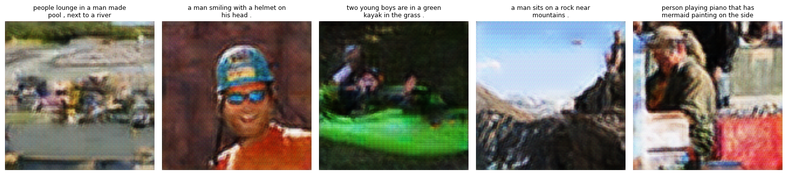

# Autoregressive Text-to-Image Generation (DALL·E 1 Style)

A from-scratch implementation of autoregressive text-to-image generation, following the approach described in the DALL·E 1 paper. The motivation was purely educational — to understand how autoregressive image generation works at a fundamental level.

## Approach

Prior text-to-image generation methods relied on complex architectures, auxiliary losses, and explicit object-part information. DALL·E 1 took a simpler route: leverage transformers and scale to model the joint distribution of text and image tokens, p(x, y).

Directly modeling over raw image pixels is computationally expensive, and models tend to capture local details rather than global structure. The solution is to introduce a discrete latent variable — encode images into discrete codes using a learned tokenizer, and then model those codes autoregressively.

### Pipeline

The implementation follows a two-stage pipeline:

**Stage 1 — Train a VQ-VAE (Image Tokenizer)**
- The VQ-VAE encoder compresses a 128×128 image into a 32×32 grid of discrete codes from a learned codebook.
- The decoder reconstructs images from these codes.
- The DALL·E 1 paper uses a dVAE, but VQ-VAE serves the same purpose: encoding images into a discrete latent space suitable for autoregressive modeling.

**Stage 2 — Train the Prior (Transformer)**
- A transformer models a single concatenated sequence of text tokens followed by image codes for each caption-image pair.
- The uniform prior p(z) = 1/K of the VQ-VAE codebook is replaced with a learned prior conditioned on text.
- At inference, a caption is fed to the transformer which autoregressively generates image codes, which are then decoded by the VQ-VAE decoder into an image.

**Text Tokenizer:** GPT-2 tokenizer (via tiktoken) with custom special tokens (`<|pad|>`, `<|startofimage|>`, `<|startoftext|>`).

**Inference:** Classifier-free guidance (CFG) is used during generation to improve text-image alignment.

## Experiments

Experiments were conducted sequentially — each one was motivated by the failures or observations of the previous.

---

### Experiment 0 — COCO Dataset

| Component | Config |
|---|---|
| Dataset | MS-COCO (~118K train images) |
| Image Size | 128×128 |
| VQ-VAE | latent_dim=8, hidden=128, codebook_size=512 |
| VQ-VAE Epochs | 2 |
| Transformer | 12 layers, 12 heads, emb_size=768, context_length=64 |
| Transformer Epochs | 1 |

**Status:** Abandoned.

**Why:** The dataset was too large for the purpose of this project. Training both the VQ-VAE and transformer on ~118K images was time-consuming given the compute and number of epochs needed. Since the goal was to implement the pipeline from scratch and see it work — not build a SOTA model — I moved to a smaller dataset.

---

### Experiment 1 — Flickr8k (latent_dim=128)

| Component | Config |
|---|---|
| Dataset | Flickr8k (~6.4K train, ~1.6K val, 1 caption per image) |
| Image Size | 128×128 |
| VQ-VAE | latent_dim=128, hidden=128, codebook_size=512 |
| VQ-VAE Epochs | 5 |
| Transformer | 12 layers → reduced to 6 layers, 12→16 heads, emb_size=768→1024, context_length=64→32 |
| Transformer Epochs | 1 (12 layers), then 15 (6 layers) |
| Optimizer | AdamW, lr=4e-4, weight_decay=0.1 |
| Latent Grid | 32×32 (1024 image tokens) |

**Observation:** Teacher-forced image code generation produced caption-aligned, perceptually coherent images. However, autoregressively generated image codes produced plain or garbage images.

**Analysis:** The initial run with 12 transformer layers was for 1 epoch. Since the dataset is small for a data-hungry transformer, reducing to 6 layers and training for 15 epochs led to overfitting. Despite overfitting, training loss hadn't converged enough. Inspecting the AR-generated image code sequences revealed that only 3–10 unique codes were being repeatedly generated. The hypothesis was that low codebook utilization was populating training sequences with repeated codes, and the model was learning to output those as a safe option when it drifted from the target sequence.

**What led to Experiment 2:** Suspected low codebook utilization was causing the model to learn degenerate sequences.

---

### Experiment 2 — Flickr8k (latent_dim=8)

| Component | Config |
|---|---|
| Dataset | Flickr8k (~6.4K train, ~1.6K val, 1 caption per image) |
| Image Size | 128×128 |
| VQ-VAE | latent_dim=8, hidden=128, codebook_size=512 |
| VQ-VAE Epochs | 8 |
| Transformer | 6 layers, 16 heads, emb_size=1024, context_length=32 |
| Transformer Epochs | 15 |
| Optimizer | AdamW, lr=4e-4, weight_decay=0.1 |

**Change from Exp 1:** Reduced VQ-VAE latent dimension from 128 to 8 to enforce higher codebook utilization.

**Observation:** Codebook utilization did improve, but AR-generated images remained the same — plain or garbage. Upon verifying entropy of codebook usage in both experiments, it was high in both cases.

**Conclusion:** Codebook utilization was not the root cause.

**What led to Experiment 3:** Suspected the local/convolutional attention pattern used for image codes might be causing repeated code generation during long (1024-token) AR sequences.

---

### Experiment 3 — Flickr8k (Single Causal Mask + All Captions)

| Component | Config |
|---|---|
| Dataset | Flickr8k (~6.4K images, all 5 captions per image → ~32K pairs) |
| Image Size | 128×128 |
| VQ-VAE | VQVAE4, latent_dim=8, hidden=128, codebook_size=512 |
| VQ-VAE Epochs | 8 |
| Transformer | 6 layers, 16 heads, emb_size=1024, context_length=32 |
| Transformer Epochs | 3 (full dataset), then 50 (100 images only) |
| Optimizer | AdamW, lr=4e-4, weight_decay=0.1 |
| Attention | Single causal mask (replacing convolutional/local attention for image codes) |

**Changes from Exp 2:**
1. Replaced the convolutional attention mask with a single causal mask. The reasoning: with local attention, no image position ever attended to the full prefix. When predicting code *t*, the strongest context was its immediate neighbors. If the model emitted a constant patch, the local window became constant, causing the same code to be predicted again and again.
2. Used all 5 captions per image instead of just 1, increasing text conditioning data ~5×.

**Observation:** AR-generated images from the full dataset (~6K images) were still garbage or plain.

**Final test — Intentional overfitting on 100 images:** Trained the transformer for 50 epochs on only 100 training images. The model memorized the training sequences. Images generated from training set captions were recognizable and caption-aligned.

**Conclusion:** This confirmed the issue all along was scale of data. The pipeline works correctly — the overfitted model proved that. But the model cannot generalize without a much larger dataset. Building a SOTA zero-shot text-to-image model requires data at extreme scale.

## Result

Below are images generated by the overfitted model (50 epochs, 100 training images) using captions from the training set. The images are recognizable and aligned with their captions, confirming the pipeline works end-to-end.

## Key Takeaway

Even 100 images are enough to validate the pipeline and understand how autoregressive image generation works. But generalization — generating coherent images for unseen captions — requires data at a scale far beyond small datasets like Flickr8k.
