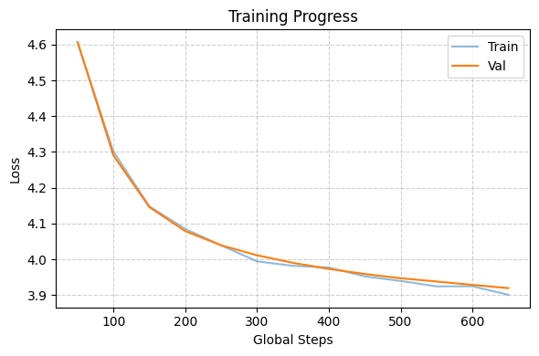
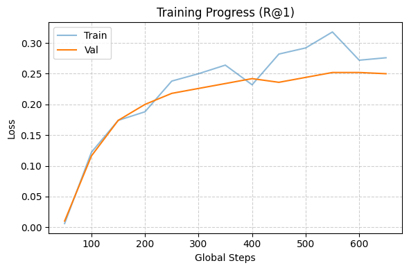
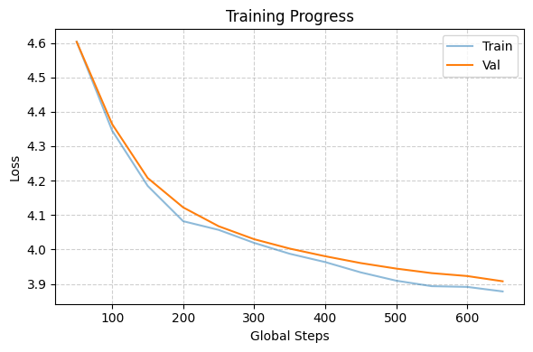
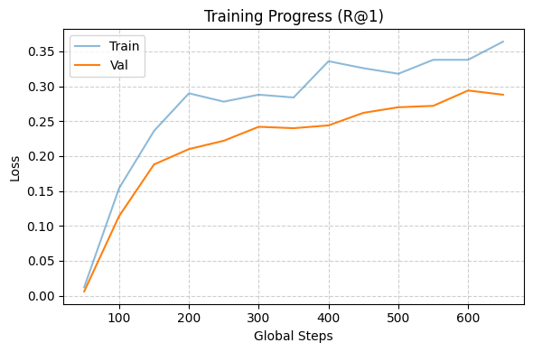
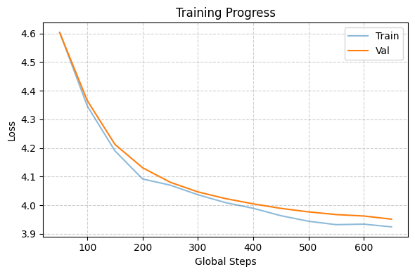
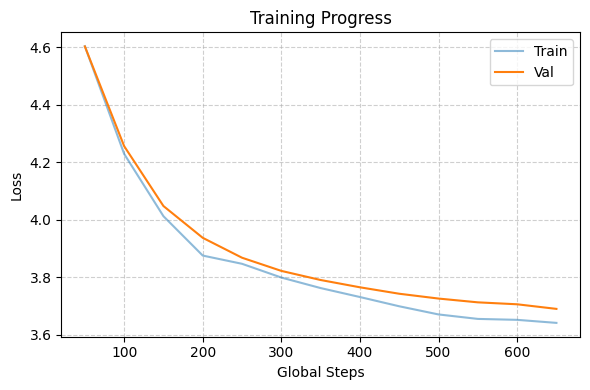
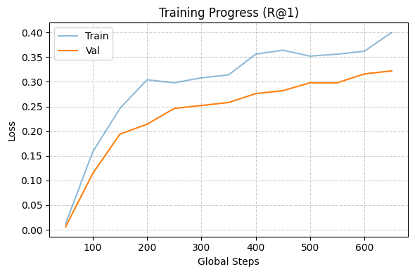
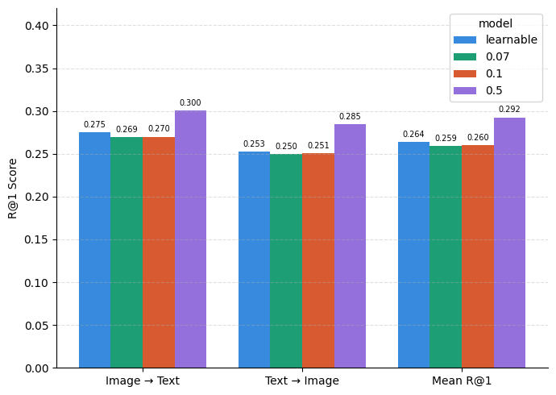
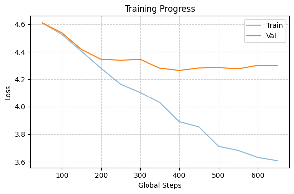
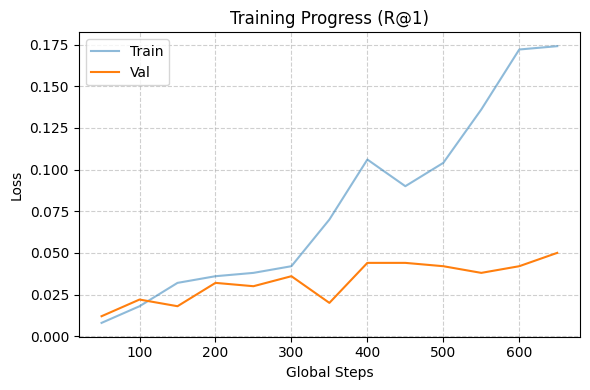

# CLIP — Contrastive Language-Image Pretraining

## Motivation

Prior state-of-the-art computer vision systems were trained to predict a fixed set of predetermined class labels. This design had two fundamental limitations:

1. **No true semantic understanding** — models learned image representations tied to specific class IDs rather than any language-level or semantic understanding of visual concepts.
2. **Limited generalizability** — to recognize new classes or adapt to a different task, the model required additional labeled data and fine-tuning, making it expensive to scale.

The core issue with task-specific models is not just the output head with a limited set of classes (which restricts generalization), but also that the image representations learned by these models are *not transferable* to other tasks.

**CLIP addresses this** by learning image representations under natural language supervision. By aligning images and text into a shared embedding space, CLIP makes image encoders generalizable and well-versed with language understanding — enabling **zero-shot transfer learning** to downstream tasks without any additional fine-tuning.

**The intuition:** a model that can perform well on visual concepts *outside* its training dataset, because it understands images through the lens of natural language rather than through fixed class labels.

---

## Objectives of This Implementation

- Implement **Vision Transformer (ViT)** from scratch
- Understand the **architecture and contrastive learning objective** of CLIP
- Observe the **impact of temperature scaling** on contrastive training

---

## Architecture

CLIP consists of two encoders that project images and text into a shared embedding space:

```
Image ──► [Image Encoder] ──► [Projection Layer] ──► Image Embedding ─┐
                                                                       ├──► Similarity Matrix (logits)
Text  ──► [Text Encoder]  ──► [Projection Layer] ──► Text Embedding  ─┘
```

---

## Learning Objective — InfoNCE Loss

The training goal is to **pull matching image-text embeddings together** and **push non-matching pairs apart** within each batch.

This is implemented as a **symmetric cross-entropy loss** over the similarity matrix:

```python
labels = torch.arange(batch_size)                       # diagonal = correct pairs
loss_i2t = cross_entropy(logits, labels)                 # image-to-text (across rows)
loss_t2i = cross_entropy(logits.T, labels)               # text-to-image (across columns)
loss = (loss_i2t + loss_t2i) / 2
```

**Evaluation metric:** Recall@1 (R@1) — the fraction of images for which the top-1 predicted text is the correct match.

---

## Dataset

**Flickr8k** — 8,091 images, each with 5 captions (only the first caption per image is used).

| Split | Samples |
|-------|---------|
| Train | 6,472   |
| Val   | 1,619   |


---

## Training Setup

All experiments share the following configuration:

| Hyperparameter | Value |
|----------------|-------|
| Epochs         | 10    |
| Optimizer      | Adam  |
| Learning Rate  | 1e-4  |
| Batch Size     | 100   |
| Image Size     | 224 x 224 |
| Dataset        | Flickr8k  |

---

## Experiments

### 1. Pretrained Encoders

For all pretrained experiments, **both encoder weights are frozen** — only the linear projection layers (mapping each modality's representation into the shared embedding space) are learned.

- **Image Encoders:** ResNet18 (ImageNet) and ViT-B/16 (ImageNet) from `torchvision`
- **Text Encoder:** BERT (`bert-base-uncased`) from HuggingFace Transformers
- **Tokenizer:** BERT tokenizer

---

#### 1.1 ResNet18 + BERT — Learnable Temperature

| | |
|---|---|
|  |  |

---

#### 1.2 ViT-B/16 + BERT — Learnable Temperature

| | |
|---|---|
|  |  |

---

#### 1.3 ViT-B/16 + BERT — Fixed Temperature = 0.07

| | |
|---|---|
|  |  |

---

#### 1.4 ViT-B/16 + BERT — Fixed Temperature = 0.1

| | |
|---|---|
|  |  |

---

#### 1.5 ViT-B/16 + BERT — Fixed Temperature = 0.5

| | |
|---|---|
|  |  |

---

### 2. Temperature Comparison



#### Observations on Temperature Scaling

The temperature parameter τ controls the sharpness of the softmax distribution over the similarity matrix:

- **Lower temperature** (e.g., τ = 0.07) produces a more **uniform** (softer) distribution. The loss becomes more forgiving — the model treats all negatives more equally, leading to slower but steadier convergence.
- **Higher temperature** (e.g., τ = 0.5) sharpens the distribution, making the contrastive objective **harder**. This results in:
  - **Faster convergence** of the loss
  - **Higher R@1 scores** — the model is pushed to produce more discriminative embeddings

---

### 3. From Scratch — ViT + Decoder-Only Transformer

> **This experiment needs to be re-run. Results and plots will be added after execution.**

In this experiment, both encoders are implemented **from scratch** and trained end-to-end with a learnable temperature (no frozen weights):

- **Image Encoder:** Vision Transformer (implemented from scratch)
  - Patch size: 16 x 16 producing 196 patches per image
  - Embedding dim: 768, Heads: 12, Layers: 12
  - Learnable `[CLS]` token and positional embeddings
  - Components: `LayerNorm`, `GeLU`, `FFN`, `MultiHeadAttention` (bidirectional), `EncoderBlock`

- **Text Encoder:** Decoder-only Transformer (implemented from scratch)
  - Embedding dim: 768, Heads: 8, Layers: 12
  - Causal (masked) self-attention
  - Tokenizer: `tiktoken` (GPT-2 encoding with custom special tokens)
  - The representation at the EOT (end-of-text) token position is used as the text embedding

- **Temperature:** Learnable

#### Results

| | |
|---|---|
|  |  |

- The performance of the model trained from scratch is significantly worse than the performance of the model trained with pretrained encoders. This is expected because the model trained from scratch has not seen any images or text before, while the model trained with pretrained encoders has seen many images and text before.
- And since the model has very high capacity, it is overfitting to the training data of ~6k samples.

---

## Key Takeaways

- Learning image representations under **natural language supervision** makes the representations generalizable, the image encoder becomes suitable for transfer learning to other downstream tasks (because of time and resource constraints, evaluation on downstream tasks like ImageNet classification is not done).
- Here, the batch size matters a lot. The larger the batch size, more the model has to make right pairs closer and wrong pairs farther. This is because the number of negative pairs increases with the batch size.
- The real leverage can be taken when very large datasets are used for training. The performance of the model is directly proportional to the size of the dataset. This can be seen from the fact that the original CLIP model was trained on 400M image-text pairs (where authors have mentioned about real results or benefits coming from very large datasets).
- The **contrastive objective** (InfoNCE) is effective at aligning two modalities into a shared space.
- **Temperature scaling** plays a critical role in contrastive learning: higher temperatures push the model to learn more discriminative embeddings, resulting in faster convergence and better retrieval performance.
