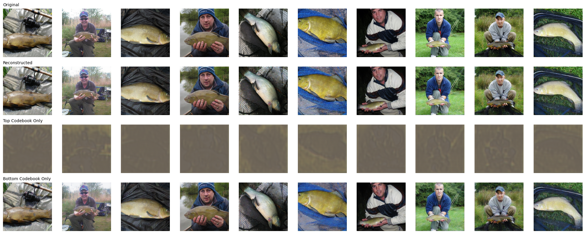
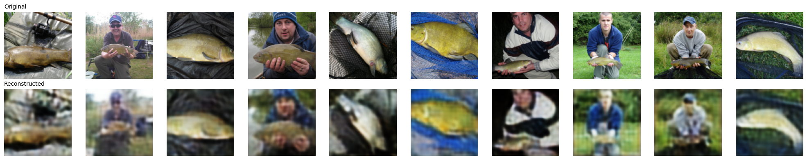

# Generative AI from Scratch

From-scratch PyTorch implementations of the core generative-vision papers: VAE, VQ-VAE, VQ-VAE-2, CLIP, and DALL·E-1-style autoregressive text-to-image. Each one is built to understand the mechanism, then pushed through ablations and written up, including the experiments that failed and why.

No wrappers, no `from diffusers import ...`. Every encoder, quantizer, transformer block, and loss is implemented by hand and studied through controlled experiments.

---

## Results at a glance

<table>
<tr>
<td align="center"> <b>DALL·E-1-style AR</b> text → image tokens</td>
<td align="center"> <b>VQ-VAE-2</b> LPIPS 0.097 with perceptual loss</td>
</tr>
<tr>
<td align="center"> <b>VQ-VAE</b> Imagenette reconstructions</td>
<td align="center"> <b>VAE</b> Bernoulli decoder, MNIST</td>
</tr>
</table>

| Topic | Paper | Dataset | Eval | Headline result |
|---|---|---|---|---|
| [**Autoencoder**](Autoencoder/) | — | MNIST | qualitative | Deterministic baseline for latent representations |
| [**VAE**](VAE/README.md) | Kingma & Welling '13 | MNIST, CIFAR-10 | qualitative (recon, latent structure) | Bernoulli decoder → sharp MNIST; **traced why an MLP encoder fails on CIFAR-10** across 7 likelihood/variance setups |
| [**CLIP**](CLIP/README.md) | Radford et al. '21 | Flickr8k | R@1 retrieval | From-scratch ViT + text transformer; **temperature-scaling study** (τ = 0.07 / 0.1 / 0.5 / learnable) |
| [**VQ-VAE**](VQVAE/README.md) | van den Oord et al. '17 | CIFAR-10, Imagenette | LPIPS, rFID | **Codebook restart → ~100% utilization** (8 experiments on collapse); prior needs data at scale |
| [**VQ-VAE-2**](VQVAE2/README.md) | Razavi et al. '19 | Imagenette | LPIPS, rFID | Perceptual loss: **LPIPS 0.44 → 0.097, rFID 74 → 34.5**; isolated the real cause of top-level collapse |
| [**Autoregressive T2I**](Autoregressive_Image_Gen/README.md) | Ramesh et al. '21 | Flickr8k, COCO | qualitative | Two-stage VQ-VAE + transformer prior; **debugged garbage samples down to data scale, not codebook collapse** |

---

## The projects

Every folder holds the implementation notebook, the experiment write-up, and the result images.

### [Autoencoder](Autoencoder/)

Deterministic encoder and decoder on MNIST, compressing an image to a fixed latent vector. The baseline to compare everything probabilistic against.

### [VAE](VAE/README.md)

Seven experiments over decoder likelihoods and variance parameterizations. Unconstrained per-pixel variance makes training unstable, clamping it limits the decoder, and a single global learnable variance turned out to be the stable choice. Bernoulli decoders gave the sharpest MNIST digits. On CIFAR-10 the latents matched the prior but carried no class structure, so I swapped the MLP encoder for a CNN to test whether spatial features were the missing piece. They weren't: reconstructions improved slightly and the latent space stayed unclustered.

### [CLIP](CLIP/README.md)

A ViT and a decoder-only text transformer written from scratch, plus runs with frozen pretrained encoders (ResNet18 + BERT, ViT-B/16 + BERT) where only the projection layers train. Trained on Flickr8k with symmetric InfoNCE and evaluated by R@1. Temperature was the interesting knob: 0.5 converged faster and retrieved better than 0.07. The from-scratch encoders performed far worse and overfit, which is what 6k pairs buys you.

### [VQ-VAE](VQVAE/README.md)

Eight experiments across three ways of updating the codebook: gradient descent, EMA, and EMA with dead-code restart. Gradient descent has a rich-get-richer problem, and utilization stayed near 10% no matter how large the batch or the latent dim. Restarting dead codes pushed utilization to roughly 100%. The surprise was that it barely helped image quality, which killed my assumption that collapse was what made samples blurry. Training a transformer prior on 12M tokens still produced garbage, so the prior is a data-scale problem.

### [VQ-VAE-2](VQVAE2/README.md)

Seven experiments on the two-level hierarchy, with and without perceptual loss. Codebook normalization is what suppresses utilization: 3% and 5% with it, 98% and 100% without. Perceptual loss cut LPIPS from 0.3461 to 0.0967 and rFID from 44.98 to 34.76. It also looked like perceptual loss was collapsing the top level, until a diagnostic run at `latent_dim=64` with the same loss produced a clear structural skeleton. The low latent dimension was the cause, not the loss.

### [Autoregressive text-to-image](Autoregressive_Image_Gen/README.md)

A VQ-VAE tokenizer turning 128×128 images into 32×32 code grids, then a decoder-only transformer over caption tokens followed by image codes, with classifier-free guidance at inference. Teacher-forced generation looked fine while autoregressive sampling emitted the same 3 to 10 codes over and over. I blamed low codebook utilization, then an entropy check ruled that out. Next suspect was the local attention mask, so I replaced it with a single causal mask. What settled it was overfitting 100 images on purpose: the samples came back recognizable and caption-aligned, which proved the pipeline worked and pinned the failure on data scale.

---

## Roadmap

- [x] Autoencoder
- [x] VAE
- [x] CLIP
- [x] VQ-VAE
- [x] VQ-VAE-2
- [x] Autoregressive Image Generation (DALL·E-1 style)
