# Variational Autoencoder — Experiments & Observations

This repository contains a from-scratch implementation of a Variational Autoencoder (VAE) with experiments across different decoder likelihoods, variance parameterizations, and datasets (MNIST, CIFAR-10).

---

## Background

Unlike a standard autoencoder that maps an input to a **fixed latent vector**, a VAE maps it to a **distribution** over latent space. The encoder outputs parameters of an approximate posterior $q(z|x)$ (mean and variance), from which latent vectors are sampled via the reparameterization trick.

The training objective is the **Evidence Lower Bound (ELBO)**:

$$\mathcal{L} = \mathbb{E}_{q(z|x)}[\log p(x|z)] - D_{KL}(q(z|x) \| p(z))$$

- **Reconstruction term** — measures how well the decoder reconstructs the input from a sampled latent vector.
- **KL divergence term** — regularizes the encoder's approximate posterior $q(z|x)$ to stay close to the prior $p(z) = \mathcal{N}(0, I)$.

The KL term ensures that the latent vectors are normally distributed around the origin, which is critical for meaningful generation and interpolation. Without it, the encoder is free to produce arbitrary distributions that don't support smooth sampling.

---

## Likelihood Choice: Bernoulli vs Gaussian

| Property | Bernoulli | Gaussian |
|---|---|---|
| **When to use** | Input data in $[0, 1]$ (e.g., normalized pixels) | Continuous, unbounded data |
| **What the decoder outputs** | Per-pixel probability | Mean (and optionally variance) |
| **Reconstruction loss** | Binary cross-entropy | Negative log-likelihood (or MSE as special case) |
| **Stability** | Generally stable | Sensitive to variance parameterization |

**Note on MSE:** Using MSE as reconstruction loss is equivalent to assuming a Gaussian likelihood with fixed unit variance. While valid, it does **not** explicitly model uncertainty, unlike a fully probabilistic Gaussian decoder.

---

## Gaussian Decoder Experiments

### Experiment 1 — Per-pixel mean + per-pixel variance (unconstrained)

The decoder outputs both $\mu(x|z)$ and $\sigma^2(x|z)$ per pixel, with no constraints on the log-variance.

**Observation:** Training is **unstable**. The decoder produces highly noisy reconstructions. Unconstrained variance allows extreme values that destabilize the likelihood optimization.

Results (MNIST)

| Reconstructions | Total Loss | Reconstruction Loss | KL Divergence |
|:---:|:---:|:---:|:---:|
| 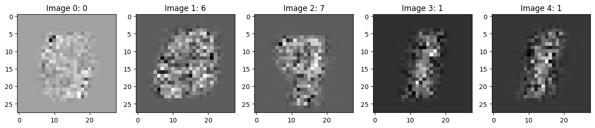 | 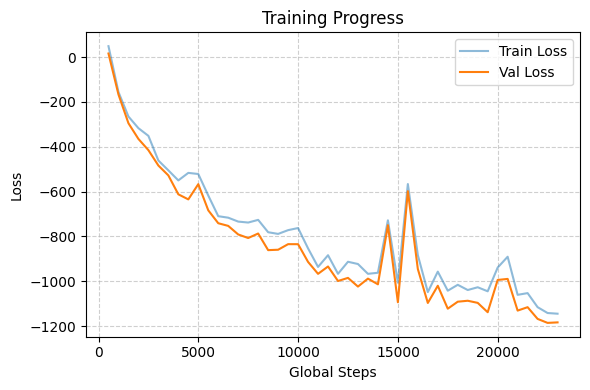 | 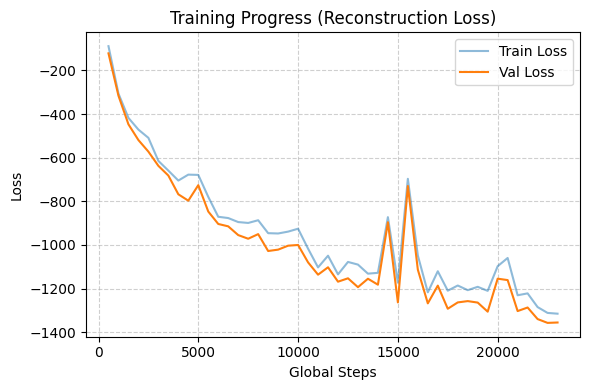 | 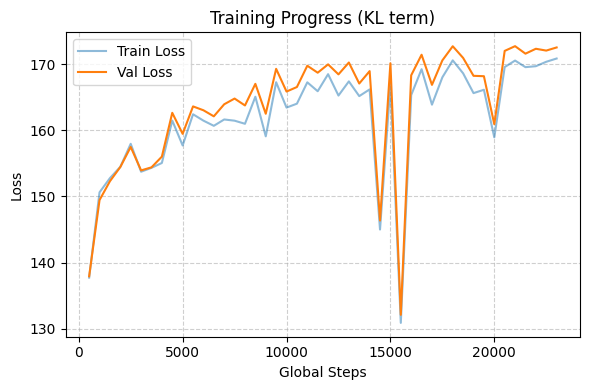 |

---

### Experiment 2 — Per-pixel mean + clamped variance

Log-variance is clamped within a fixed range (e.g., $[-4, 4]$).

**Observation:** Training is **more stable** than the unconstrained case. Reconstructions improve slightly — the model starts capturing the data distribution. However, the loss stagnates (~-250) and reconstructions remain **blurry and noisy**. Hard clamping stabilizes training but introduces optimization constraints that limit decoder expressivity.

Results (MNIST)

| Reconstructions | Total Loss | Reconstruction Loss | KL Divergence |
|:---:|:---:|:---:|:---:|
| 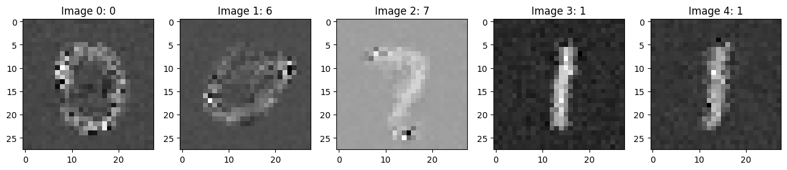 | 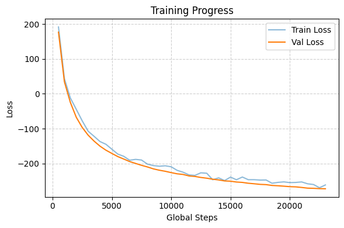 | 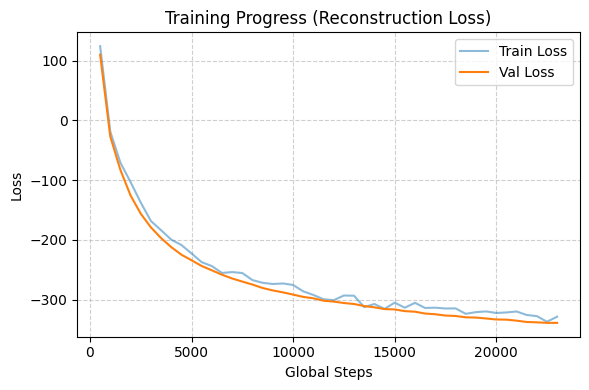 | 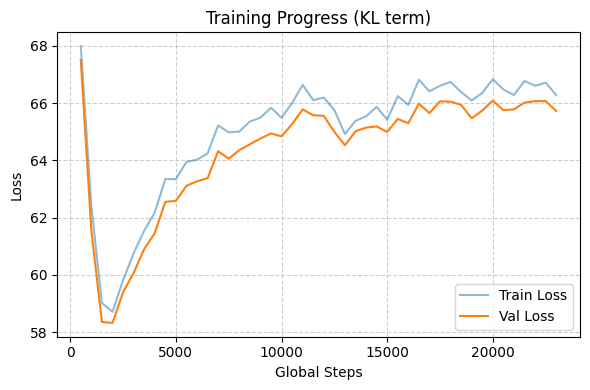 |

---

### Experiment 3 — Per-pixel mean + global learnable variance

The decoder predicts per-pixel mean conditioned on $z$, but uses a **single global learnable variance parameter** shared across all pixels.

**Observation:** **Most stable training** among all Gaussian setups. Loss stabilizes (~300). The latent space is approximately standard normal (mean $\approx 0$, variance $\approx 1$ across dimensions). Reconstructions show **visually clearer digits**, though slightly noisy. Reducing variance flexibility improves optimization stability and encourages better latent regularization.

Results (MNIST)

| Reconstructions | Total Loss | Reconstruction Loss | KL Divergence |
|:---:|:---:|:---:|:---:|
| 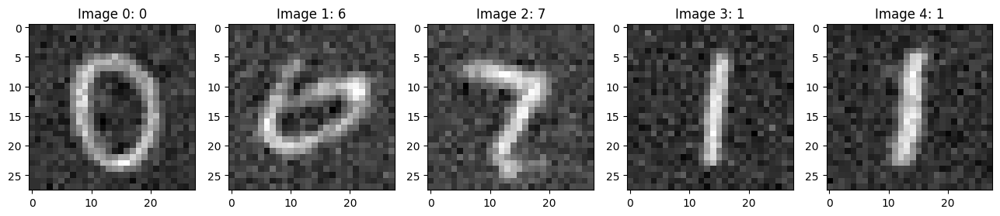 | 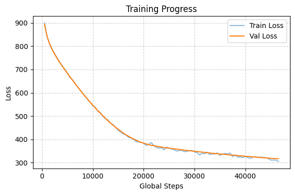 | 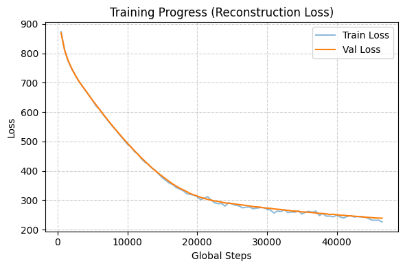 | 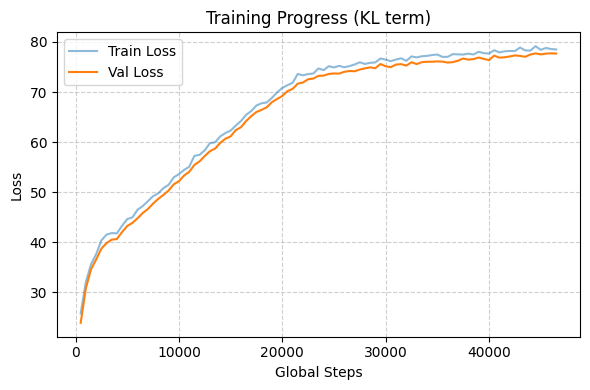 |

| t-SNE of Latent Space | Same-class Interpolation | Cross-class Interpolation | Random Samples |
|:---:|:---:|:---:|:---:|
| 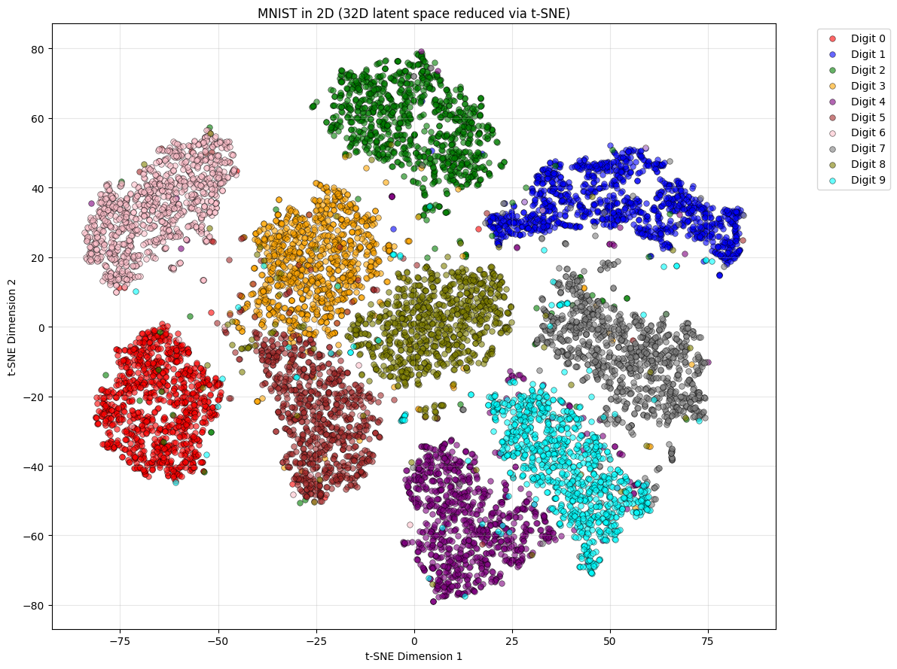 | 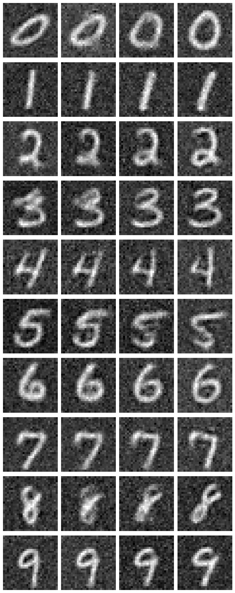 | 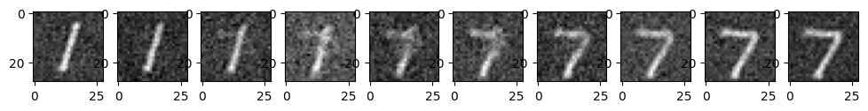 | 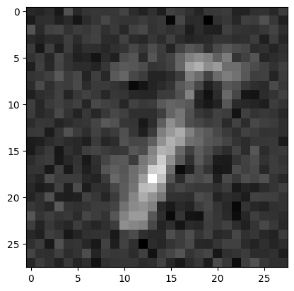 |

---

### Experiment 4 — CIFAR-10 + Multi-sample Gaussian Decoder

Global variance decoder with multiple latent samples $z_1, ..., z_n \sim q(z|x)$ to form a Monte Carlo estimate of $\mathbb{E}_{q(z|x)}[\log p(x|z)]$.

**Observation:** Loss converges (~2600) then stagnates. Reconstructions are **extremely noisy**. KL divergence starts high and fluctuates significantly. The latent space is approximately Gaussian (mean $\approx 0$, variance $\approx 1$) but shows **no clear clustering** across classes in t-SNE. Although the latent distribution matches the prior, the encoder fails to learn informative representations — likely due to using an MLP encoder for high-dimensional structured data. CIFAR-10's high intra-class variability (background, color, texture) makes compression with a simple MLP impractical.

Results (CIFAR-10)

| Reconstructions | Total Loss | Reconstruction Loss | KL Divergence |
|:---:|:---:|:---:|:---:|
| 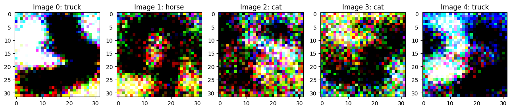 | 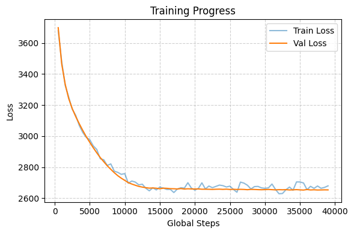 | 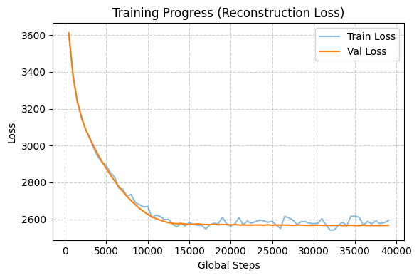 | 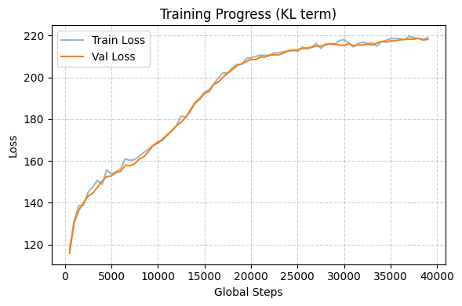 |

| t-SNE of Latent Space | Same-class Interpolation | Cross-class Interpolation | Random Samples |
|:---:|:---:|:---:|:---:|
| 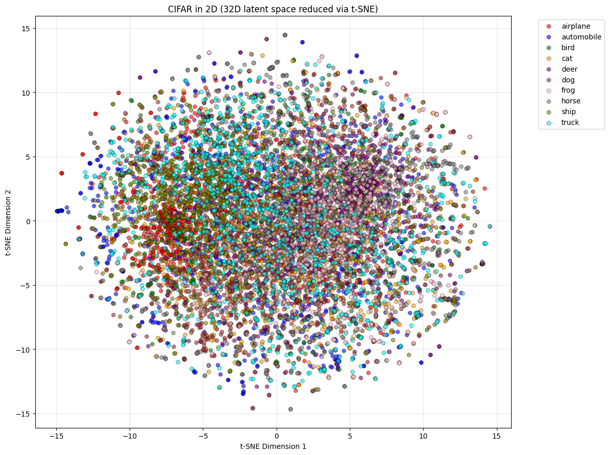 | 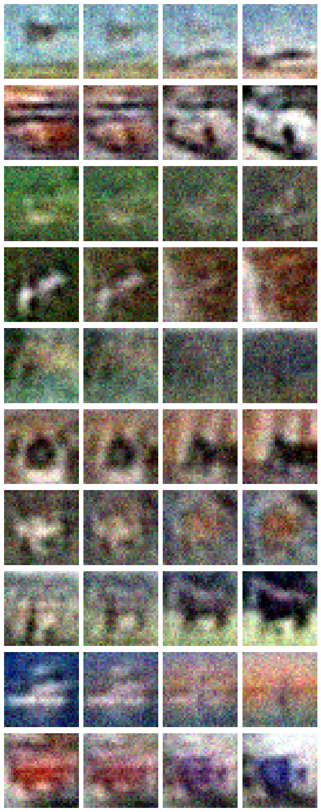 | 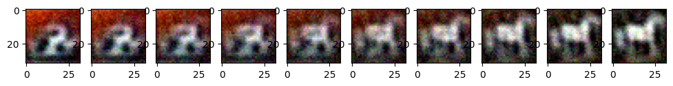 | 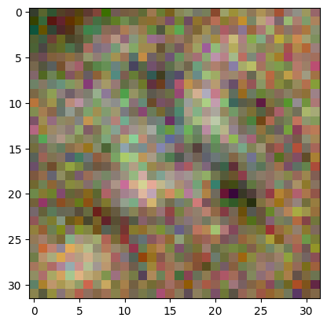 |

---

## Bernoulli Decoder Experiments

### Experiment 5 — MNIST + Bernoulli Decoder

Decoder outputs Bernoulli probabilities. Reconstruction uses the **mean (probability)** directly instead of sampling.

**Observation:** **Most stable training** overall. KL divergence stays within a reasonable range and stabilizes (~20k steps). Reconstructions are **sharp and clearly visible** — not blurry. However, the latent space is only loosely clustered and does **not strictly match the standard normal prior**. Even with good reconstructions, the encoder is not fully aligned with the prior, which manifests in latent interpolations producing inconsistent outputs — the latent space is not semantically smooth.

Results (MNIST)

| Reconstructions | Total Loss | Reconstruction Loss | KL Divergence |
|:---:|:---:|:---:|:---:|
| 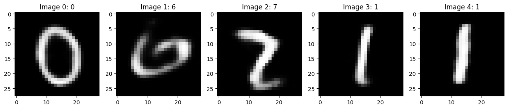 | 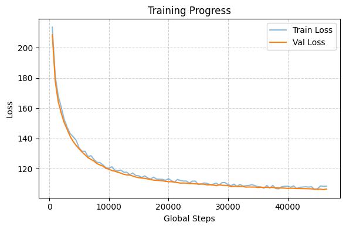 | 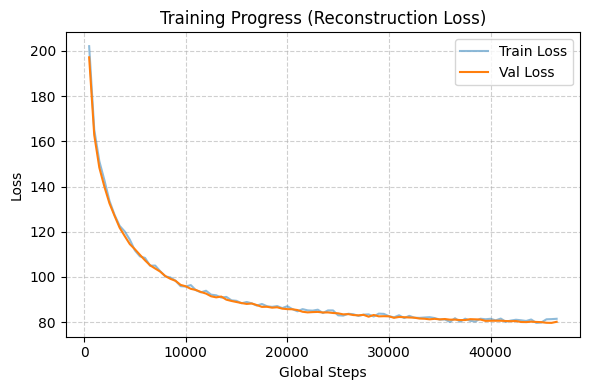 | 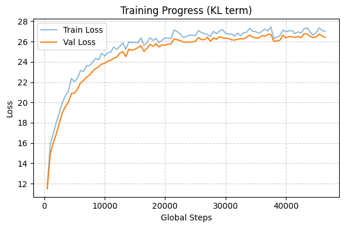 |

| t-SNE of Latent Space | Same-class Interpolation | Cross-class Interpolation | Random Samples |
|:---:|:---:|:---:|:---:|
| 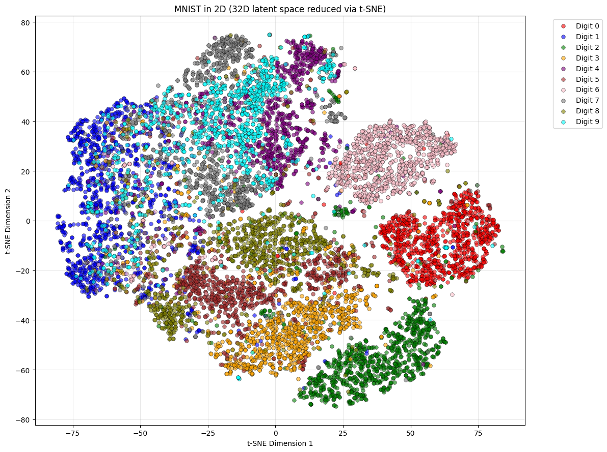 | 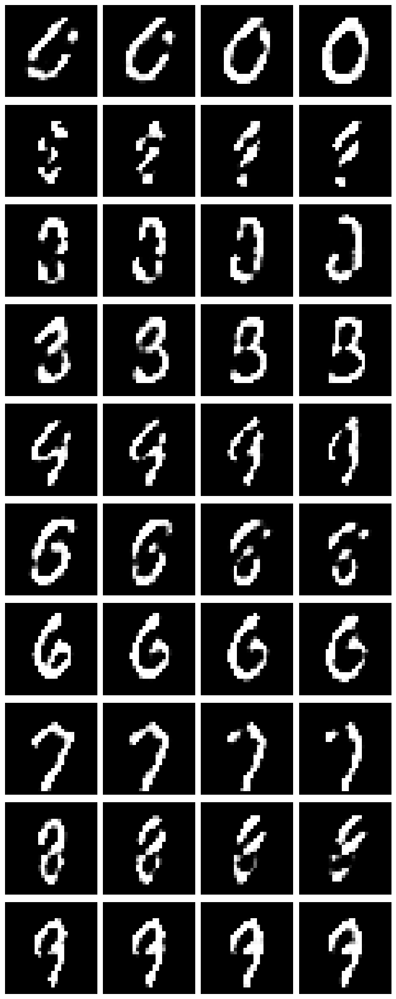 | 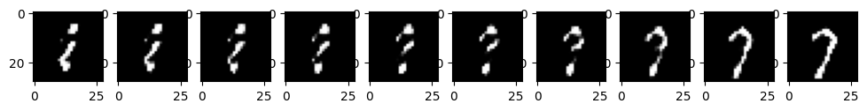 | 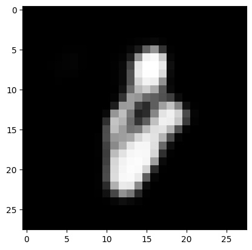 |

---

### Experiment 6 — CIFAR-10 + Multi-sample Bernoulli Decoder

Same multi-sample Monte Carlo approach as the Gaussian CIFAR-10 experiment, but with Bernoulli likelihood.

**Observation:** Training is **stable**. KL divergence remains controlled. Reconstructions are **better and less noisy than the Gaussian decoder**, though still blurry. Loss stagnates (~1850). The latent space is approximately Gaussian (mean $\approx 0$, variance $\approx 1$) but shows no class-wise clustering in t-SNE. The same fundamental limitation persists: the MLP encoder struggles with the complex image distribution. High intra-class variability prevents meaningful latent clustering.

Results (CIFAR-10)

| Reconstructions | Total Loss | Reconstruction Loss | KL Divergence |
|:---:|:---:|:---:|:---:|
| 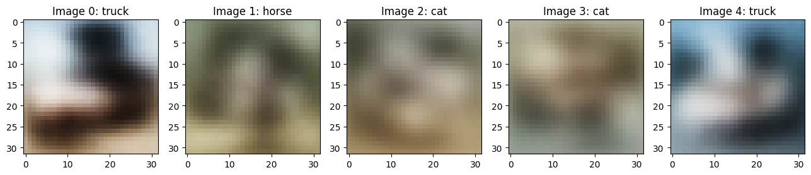 | 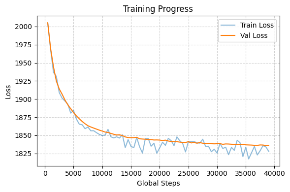 | 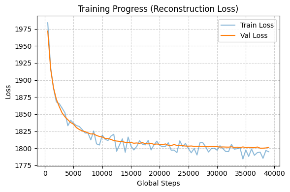 | 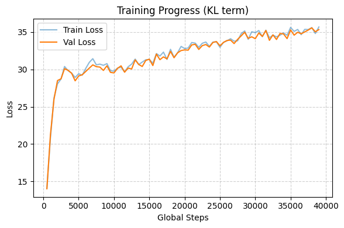 |

| t-SNE of Latent Space | Same-class Interpolation | Cross-class Interpolation | Random Samples |
|:---:|:---:|:---:|:---:|
| 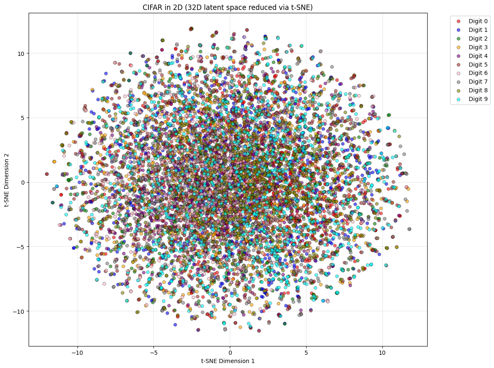 | 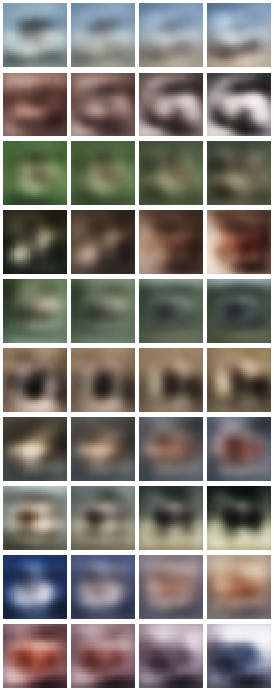 | 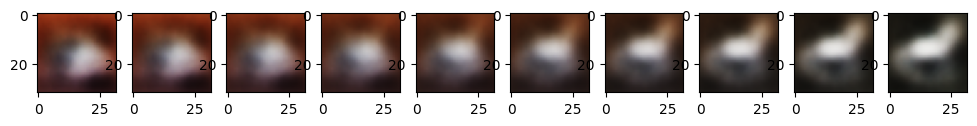 | 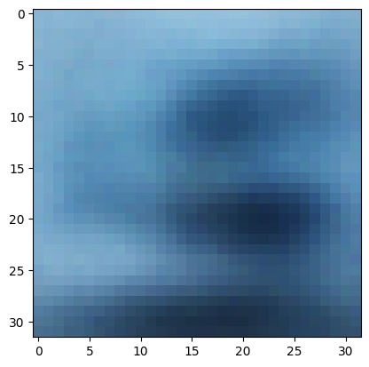 |

---

## Summary of Results

| # | Dataset | Decoder | Variance | Stability | Reconstruction Quality | Latent Structure |
|---|---|---|---|---|---|---|
| 1 | MNIST | Gaussian | Per-pixel (unconstrained) | Unstable | Noisy | — |
| 2 | MNIST | Gaussian | Per-pixel (clamped) | Moderate | Blurry, noisy | — |
| 3 | MNIST | Gaussian | Global learnable | Stable | Clear, slightly noisy | ~Standard normal, Tightly clustered |
| 4 | CIFAR-10 | Gaussian | Global learnable | Stable | Extremely noisy | No clustering, Standard Normal |
| 5 | MNIST | Bernoulli | N/A | Most stable | Sharp, clear | Loosely clustered, Not matching prior |
| 6 | CIFAR-10 | Bernoulli | N/A | Stable | Better than Gaussian, still blurry | No clustering, Standard Normal |

---

## Key Takeaways

**Decoder likelihood choice matters.** Bernoulli decoders produce sharper reconstructions for bounded pixel data ($[0,1]$). Gaussian decoders are more flexible but harder to train due to variance instability.

**Variance parameterization is critical.** Too flexible (per-pixel, unconstrained) leads to unstable training. Too constrained (hard clamping) limits expressivity. A global learnable variance provides the best stability trade-off.

**Latent distribution matching does not imply meaningful representation.** Even when $q(z|x) \approx \mathcal{N}(0, I)$, the latent vectors may not encode useful information about the input.

**Model architecture matters more for complex data.** An MLP encoder works well for MNIST (low variability, simple structure) but fails for CIFAR-10 due to spatial structure and texture/color variability that a fully-connected network cannot efficiently capture.

---

## Conclusion

For **simple datasets** like MNIST, an MLP-based VAE can learn meaningful latent structure. Latent interpolations produce semantically consistent outputs, and both Bernoulli and (properly configured) Gaussian decoders achieve reasonable reconstruction quality.

For **complex datasets** like CIFAR-10, an MLP encoder is insufficient. Even with stable training and proper likelihood modeling, the latent space lacks structure and reconstructions remain blurry.

A **CNN-based encoder and decoder** is expected to:
- Capture spatial correlations in the input
- Learn more informative latent representations
- Improve reconstruction quality and semantic consistency in the latent space
