# VQ-VAE — Vector Quantized Variational Autoencoder

I implemented VQ-VAE from scratch after reading the [Neural Discrete Representation Learning](https://arxiv.org/abs/1711.00937) paper. The goal was to understand VQ-VAE at the mechanism and architecture level.

My implementations are divided into three categories based on how the codebook is updated:
1. Gradient Descent based update
2. EMA (Exponential Moving Average) codebook update
3. EMA update + codebook restart for underutilized codes

---

## Why Not VAE and Continuous Latent Space?

### VAE Failure Modes

In VAE, the model (encoder + decoder) learns by optimizing reconstruction loss and KL divergence. The encoder outputs a latent distribution from which z is sampled, and the decoder reconstructs x from sampled z.

However, a strong autoregressive decoder like Transformer or PixelCNN is capable of modeling p(x) without the latent vector z — the decoder models the distribution as p(x|x<sub>-1</sub>) and not p(x|z), thus ignoring z. This results in q(z|x) exactly matching p(z) (the prior) and the encoder doesn't encode anything meaningful — KL goes to 0. This is called **posterior collapse**. Yes, the model minimizes ELBO, but the latent space isn't useful.

### Weak Prior

In my VAE experiment, randomly sampling latent from the prior after training generated garbage images.

This is because the standard normal prior is a weak prior. During training, the KL term pushes q(z|x) towards it — the posterior never exactly matches that distribution. And even if it does match, then the encoder stops encoding meaningful latents since for all images x, the latents share the same region in latent space (posterior collapse).

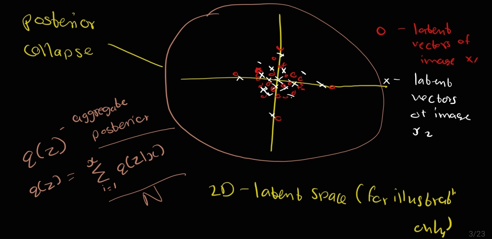

As can be seen in the graph, both images' latent distributions are overlapping and hence are not meaningful.

In reality, q(z|x) comes close to standard normal but doesn't exactly match it. q(z) is the **aggregate posterior** — a mixture of Gaussians, one per training example. And as can be seen from the graph below, the standard normal is a poor approximation to this. A randomly sampled z from the prior can land in the empty space where no training image ever mapped to, and hence the decoder generates garbage.

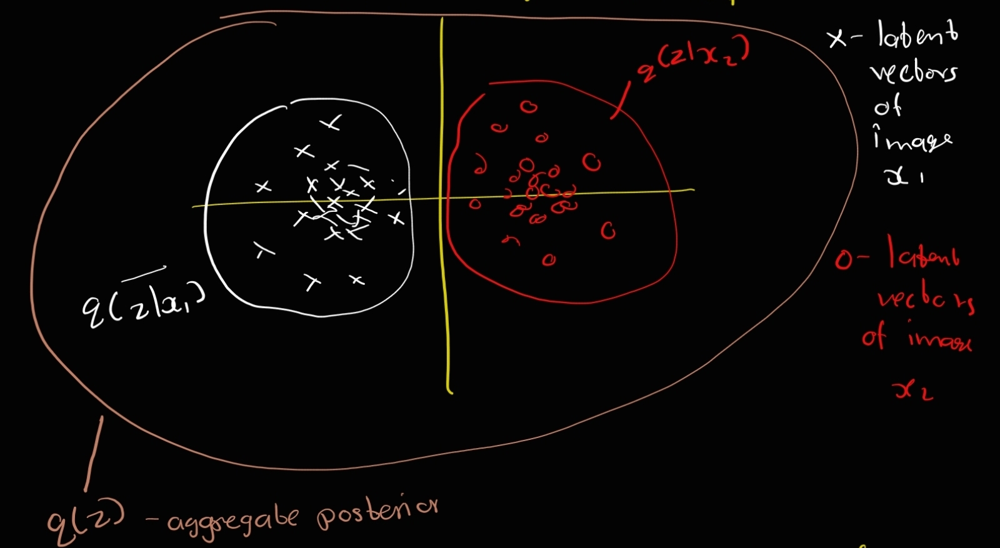

### VAE Fix and Why It's Hard

The fix is to learn a new prior that fits the aggregate posterior q(z) after VAE training, and then sample from this newly learnt prior instead of standard normal. But learning a prior over continuous latent spaces is difficult — because there is infinite space and hence infinite possible latents. In order to sample well from a new prior, we need to learn q(z) which has a complicated distribution and learn its structure: empty regions, correlations between dimensions, and modes.

---

## Why Discrete Vectors?

Because it is a more natural fit than continuous vectors over many modalities. Language is discrete, speech is represented as a sequence of symbols, images can often be described by language.

### How VQ-VAE Overcomes Posterior Collapse

VQ-VAE doesn't have a probabilistic bottleneck — the encoder output gets matched to the nearest codebook vector. There is no "ignore z and minimize KL" mechanism that rewards or benefits the model. In contrast, here ignoring z makes reconstruction worse with no compensating loss term (like KL) going down. So there is no incentive in VQ-VAE for posterior collapse.

### Learning the Prior in Discrete Space

Does VQ-VAE not need to learn a prior? No — VQ-VAE also needs to learn a prior. During training, VQ-VAE has a fixed uniform prior p(z) = 1/K, which is a very rough approximation of the encoder's output distribution over different training samples. So in order to sample well, we need to learn a prior that models the aggregate posterior q(z).

But learning the prior in discrete space is easy because:
- There are no infinite possible latent embeddings
- No Gaussian approximation needed
- No empty spaces — every sampled code sequence is guaranteed to be in the codebook

We just have to learn the distribution of discrete codes (indices of codebook embeddings) over a sequence of integers, which can be very well handled by an autoregressive model (Transformers). We can sample discrete codes autoregressively from the learned prior, get corresponding codebook embeddings based on the code sequence, and use the decoder to generate.

---

## Architecture

```
Image ──► [Encoder] ──► z_e(x) ──► [Nearest Codebook Lookup] ──► z_q(x) ──► [Decoder] ──► Reconstruction
                                           |
                                     [Codebook: K vectors of dim D]
```

- **Encoder:** CNN with residual blocks — outputs continuous latent map z_e(x)
- **Vector Quantization:** each spatial position in z_e(x) is replaced with its nearest codebook vector
- **Decoder:** CNN with residual blocks — reconstructs the image from quantized latent map z_q(x)

---

## Training Objective

The total loss consists of three terms:

```
L = L_reconstruction + L_codebook + beta * L_commitment
```

| Term | Description |
|------|-------------|
| Reconstruction loss | Binary cross-entropy between input and reconstruction |
| Codebook loss | Moves codebook vectors towards encoder outputs (gradient flows only to codebook) |
| Commitment loss | Encourages encoder outputs to stay close to assigned codebook vectors (gradient flows only to encoder) |

### Straight-Through Estimator

There is one problem with mapping z_e(x) to the codebook — argmin is non-differentiable and gradients can't flow back. So we copy the gradient of z_q(x) to z_e(x). Since both representations share the same D-dimensional space, the gradients contain useful information for how the encoder has to change its output to lower the reconstruction error.

---

## Dataset & Training Setup

**CIFAR-10** — 60,000 32x32 color images

| Hyperparameter | Value |
|----------------|-------|
| Epochs         | 20    |
| Optimizer      | Adam  |
| Learning Rate  | 1e-4  |
| Beta           | 0.25  |
| Evaluation     | LPIPS, rFID |

---

## Experiments

### 1. Gradient Descent Codebook Update

Codebook vectors are treated as learnable parameters and updated via standard gradient descent through the codebook loss term.

---

#### Exp 1 — Baseline

`latent_dim=256, k=512, batch_size=64`

| | | | |
|---|---|---|---|
| 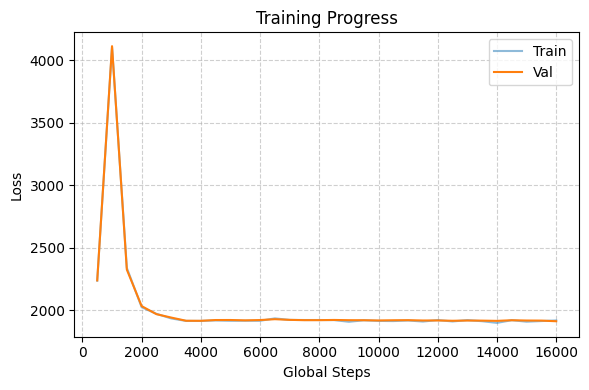 | 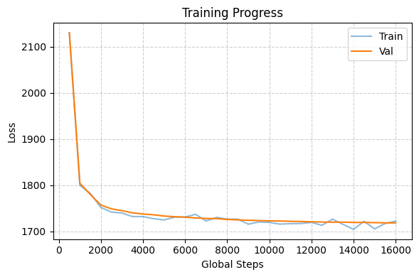 | 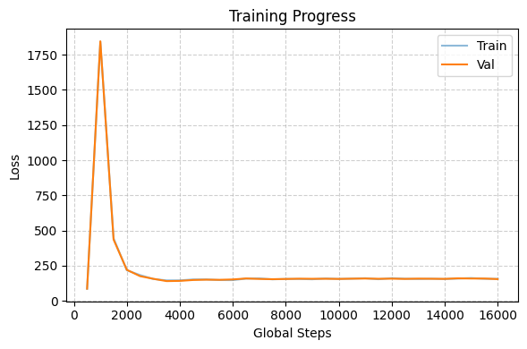 | 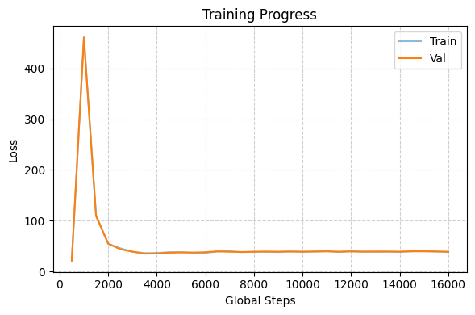 |


---

#### Exp 2 — Larger Latent Dim

`latent_dim=512, k=512, batch_size=64`

Increasing the latent_dim to 512 from 256.

| | | | |
|---|---|---|---|
| 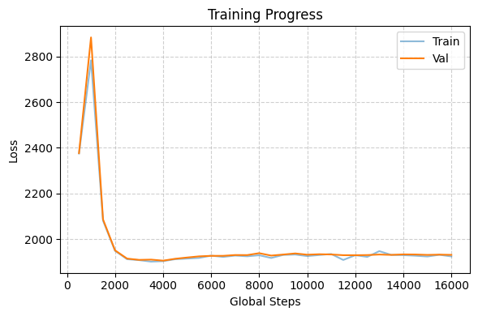 | 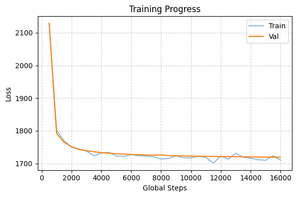 | 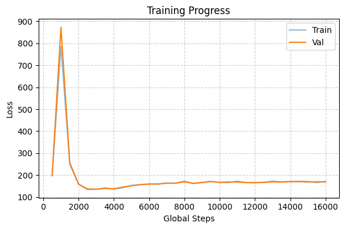 | 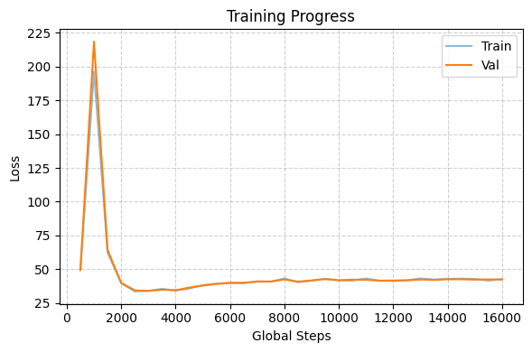 |

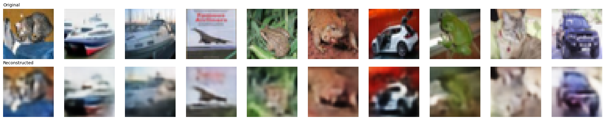

**Observation:** Based on exp 2, it can be said that latent_dim is not the cause of blurry image generation. Upon looking at codebook utilization in both experiments (1 and 2), the lower utilization (~0.1) seems to be the problem.

---

#### Exp 3 — Larger Batch Size

`latent_dim=256, k=512, batch_size=1024`

With minibatches, the codebook update depends on which discrete latents were utilized in previous steps — the ones which were utilized are improved and the others remain the same. Since the utilized discrete latents were improved, they are again utilized and further get improved. **Rich gets richer problem.** Experimenting with larger minibatches.

| | | | |
|---|---|---|---|
| 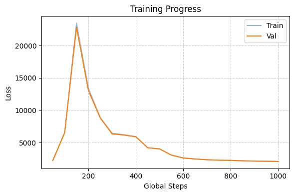 | 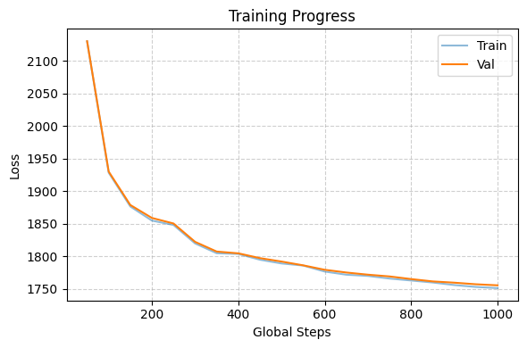 | 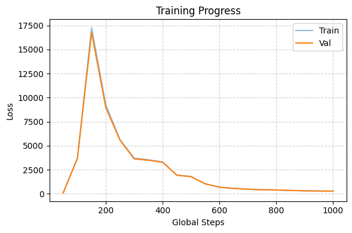 | 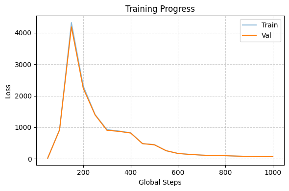 |

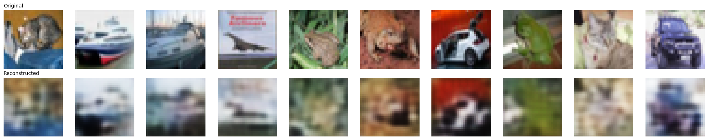

**Observation:** Even with the larger minibatches of size 1024, the codebook utilization is still ~0.1. No improvement with larger minibatches. Can try EMA codebook updates.

---

### 2. EMA Codebook Update

Using EMA codebook update instead of gradient descent based update. EMA is more stable since it directly updates the codebook embeddings to what they should be — each codebook vector moves towards the mean of encoder outputs assigned to it.

---

#### Exp 4 — EMA Baseline

`latent_dim=256, k=512, batch_size=64, decay=0.99`

| | | |
|---|---|---|
|  |  | 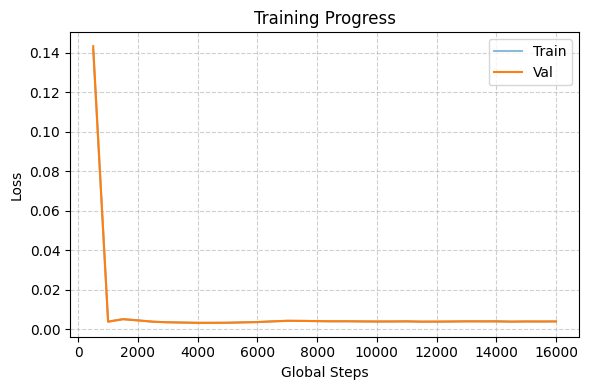 |

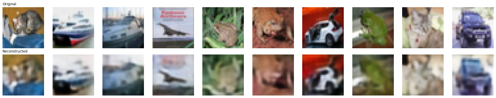

**Observation:** The codebook utilization seems to have been improved slightly to ~0.2, but still it is very low and causing the model to stop learning.

---

#### Exp 5 — Lower Decay

`latent_dim=256, k=512, batch_size=64, decay=0.80`

Decreasing decay from 0.99 to 0.80 so that codebook gives slightly more weight to current batch's encoder sum and discrete code count, which further can update codebook towards encoder outputs faster.

| | | |
|---|---|---|
| 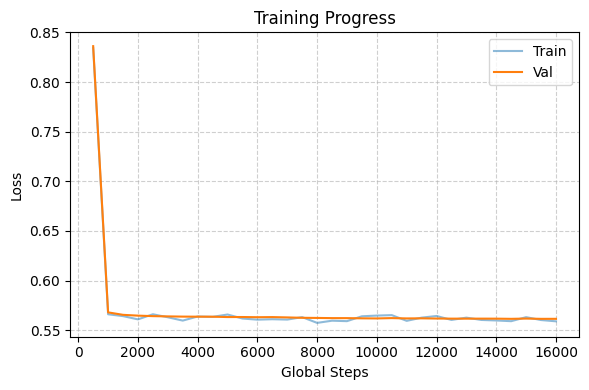 |  |  |

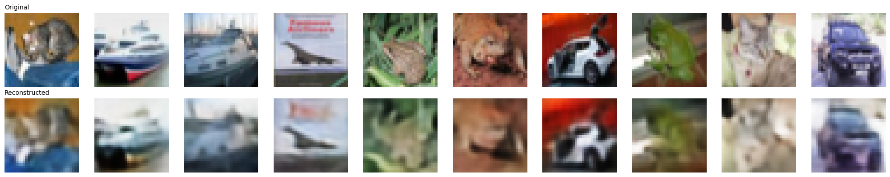

**Observation:** No improvement.

---

#### Exp 6 — Larger Batch Size

`latent_dim=256, k=512, batch_size=512, decay=0.99`

| | | |
|---|---|---|
| 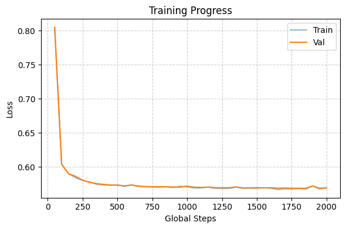 | 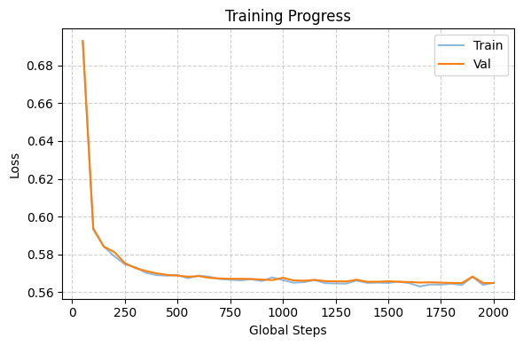 | 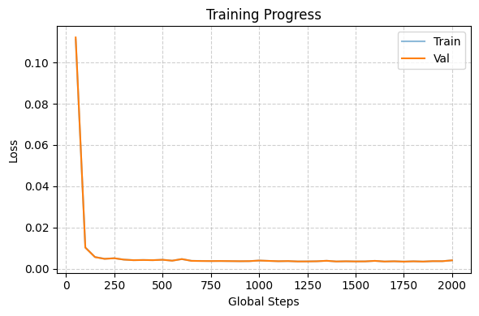 |

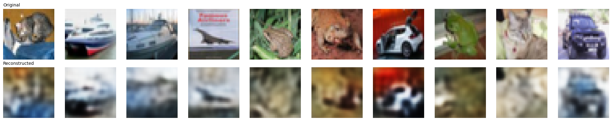

**Observation:** No improvement even after considering larger batch size.

---

#### Exp 7 — Smaller Codebook

`latent_dim=256, k=128, batch_size=64, decay=0.99`

Reducing codebook size from 512 to 128.

| | | |
|---|---|---|
| 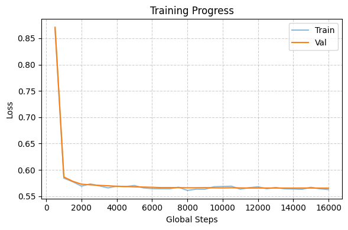 |  | 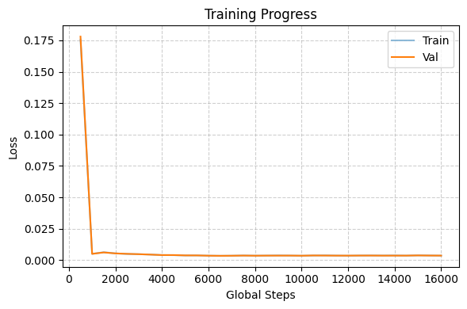 |

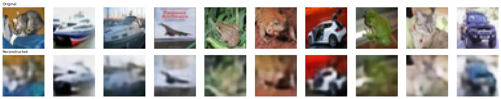

**Observation:** The code utilization proportion has increased after decreasing the number of codes in codebook, however, there's no improvement in model training.

---

### 3. EMA Codebook Update + Codebook Restart

Adding a codebook restart mechanism — when dead (underutilized) codes are detected, those codes are re-initialized by sampling from the current batch's encoder outputs. This directly addresses the codebook collapse problem.

---

#### Exp 8 — EMA + Codebook Restart

`latent_dim=256, k=512, batch_size=64, decay=0.99`

Codebook restart upon increased dead codes count.

| | | |
|---|---|---|
| 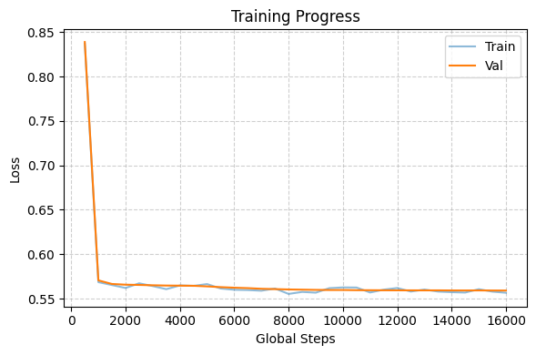 | 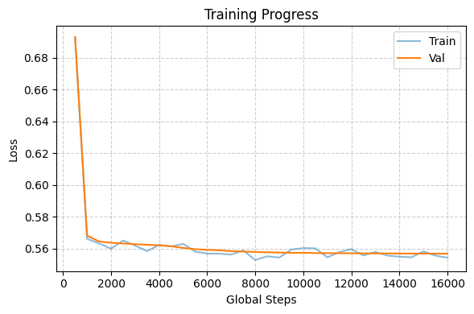 | 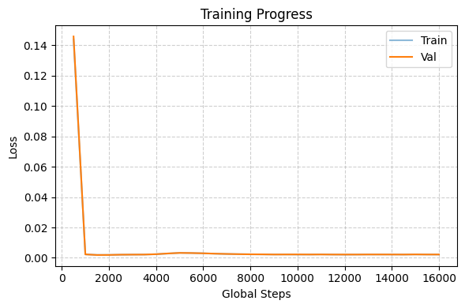 |

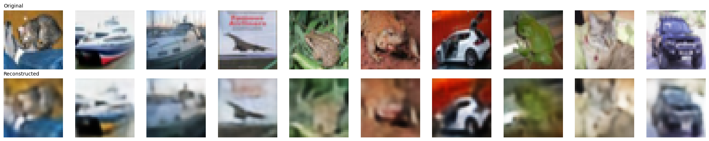

---

## Generation Quality Comparison

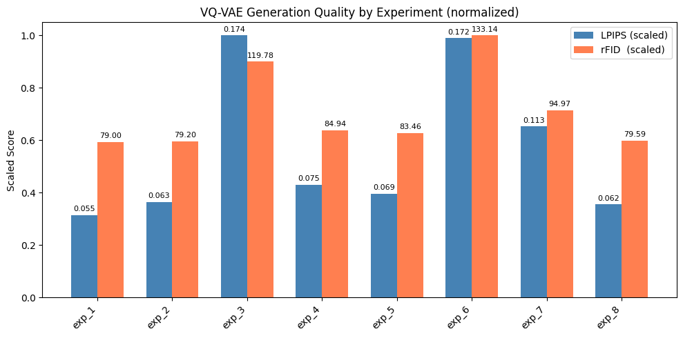

- Lower LPIPS and rFID is better.
- One interesting observation is that the model with higher codebook utilization is not necessarily the one with better generation quality and vice-versa. For example, in exp 1, the codebook utilization is ~0.1 and the generation quality is better than exp 8 where the codebook utilization is ~1.0.

---

## Key Takeaways

- **Codebook utilization** is the central challenge in VQ-VAE training. Low utilization (codebook collapse) causes the model to stop learning — most codes go unused while a few popular codes carry all the load.
- **Gradient descent codebook update** suffers from the rich-get-richer problem — only utilized codes get gradients, they keep getting selected, and further improve while unused codes stagnate.
- **EMA update** is more stable and direct, but does not solve the codebook collapse on its own.
- **Codebook restart** (re-initializing dead codes from encoder outputs) directly addresses codebook collapse.
- The **straight-through estimator** makes training possible despite the non-differentiable quantization step — it works because encoder outputs and codebook vectors share the same embedding space.

---

## Future Work

- Try beta=0.1 or lower — this will allow encoder output to be updated more towards improving reconstruction rather than being close to the assigned discrete code
- Try LayerNorm on encoder's output (hypothesis: encoder output having same scale can solve codebook collapse)