# VQ-VAE-2 — Hierarchical Vector Quantized Variational Autoencoder

I implemented VQ-VAE-2 from scratch after reading the [Generating Diverse High-Fidelity Images with VQ-VAE-2](https://arxiv.org/abs/1906.00446) paper. Building on top of my VQ-VAE implementation, the goal was to understand how hierarchical discrete latent representations improve both reconstruction quality and the separation of local vs. global image information.

---

## From VQ-VAE to VQ-VAE-2

The core idea hasn't changed — an image is encoded into discrete latent codes and reconstructed from those codes. The difference is purely engineering: **VQ-VAE-2 uses a hierarchy of codebooks instead of a single one.**

In standard VQ-VAE, a single codebook is responsible for capturing everything about the image — texture, color, shapes, and global structure — all crammed into one set of discrete codes. VQ-VAE-2 explicitly splits this responsibility across two levels:

| Level | Captures | Spatial Resolution |
|-------|----------|--------------------|
| **Top** | Global structure — object shapes, scene layout, geometry | Low (coarse) |
| **Bottom** | Local detail — texture, color, fine-grained features | High (fine) |

Crucially, the **bottom encoder is conditioned on the top codes**. This means the bottom level doesn't need to re-encode the global structure — it only needs to encode what's left after the top level has already described the coarse layout. This is analogous to describing an image to two people sequentially:

- **First person (10 words):** *"Portrait of a woman, dark background"*  
- **Second person (50 words, after hearing the first):** *"Curly red hair, blue eyes, slight smile, pearl earrings"* — no need to repeat what was already said.

---

## Why VQ-VAE-2 Produces Sharper and More Diverse Images

To understand this, it helps to frame the problem through the lens of KL divergence.

### Forward KL — `KL(p_data || p_model)`

Penalizes the model when real data exists but the model assigns low probability. The model is forced to cover **all modes** of the data — it would rather be vague everywhere than miss a mode entirely. This is **mean-seeking** behavior, which leads to blurry, averaged-out generations. This is what likelihood-based models like standard VAEs suffer from.

### Backward KL — `KL(p_model || p_data)`

Penalizes the model when it generates samples that don't exist in real data. The model picks **one or a few modes** and covers them well while ignoring others. This is **mode-seeking** behavior — it produces sharp images but suffers from mode collapse. This is the implicit objective of GANs.

### Where VQ-VAE-2 Fits

VQ-VAE-2 sidesteps this tradeoff. By using hierarchical discrete codes with a strong autoregressive prior (PixelSnail), it achieves both **sharpness** (due to the expressive, perceptually-tuned reconstruction) and **diversity** (due to the negative log likelihood objective). The hierarchical structure also makes the prior easier to learn — the top-level prior models global content independently, and the bottom-level prior models local details conditioned on global context.

---


## Training Objective

```
L = L_reconstruction + β · L_commitment_top + β · L_commitment_bottom [+ λ · L_perceptual]
```

| Term | Description |
|------|-------------|
| `L_reconstruction` | BCE or MSE between input and reconstructed image |
| `L_commitment` | Keeps encoder outputs close to their assigned codebook vectors (per level) |
| `L_perceptual` | LPIPS-based loss to encourage perceptually sharper reconstructions (optional) |

Codebook embeddings are updated using **EMA** (Exponential Moving Average) — each codebook vector moves toward the mean of encoder outputs assigned to it, bypassing gradient descent entirely.

---

## Dataset & Common Training Setup

**Dataset:** [Imagenette](https://github.com/fastai/imagenette) — a 10-class subset of ImageNet  
**Training size:** ~9,000 images  
**Image size:** 256×256

| Hyperparameter | Value |
|----------------|-------|
| Batch Size | 8 |
| Epochs | 4 |
| Optimizer | Adam |
| Learning Rate | 1e-4 |
| Codebook Size | 512 (both levels) |
| Hidden Channels | 128 |
| Residual Channels | 64 |
| Codebook Update | EMA |

---

## Experiments

Experiments are split into two sets based on the loss function used.

---

### Set 1 — Reconstruction + Commitment Loss

---

#### Exp 1 — Normalized Codebook, High Latent Dim

`normalize_codebook=True, latent_dim=64`

| Loss Curves | |
|---|---|
| 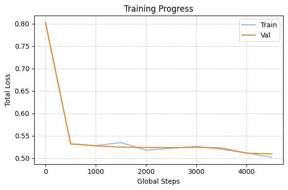 | 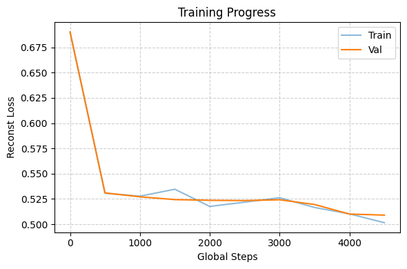 |
| 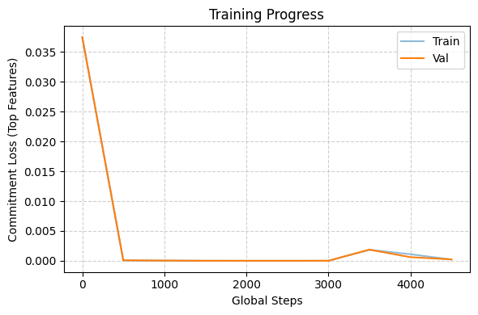 | 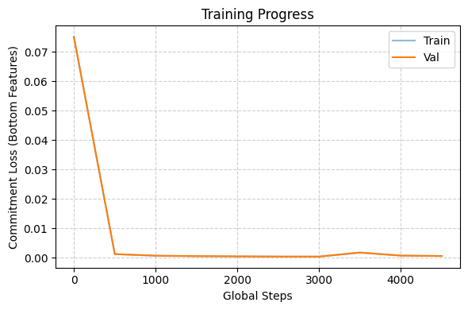 |

| Codebook Utilization | |
|---|---|
| 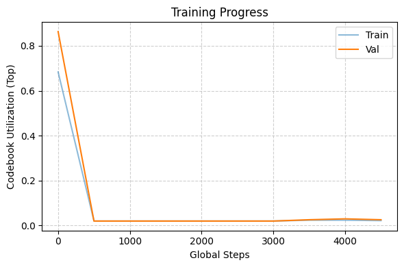 | 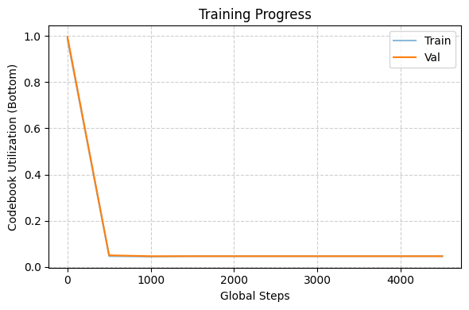 |

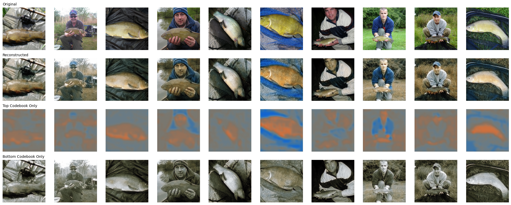

| Metric | Value |
|--------|-------|
| Top Codebook Utilization | **3%** |
| Bottom Codebook Utilization | **5%** |
| LPIPS | 0.4385 |
| rFID | 73.58 |

**Observations:**
- Codebook utilization is extremely low at both levels — nearly the entire codebook is unused.
- Top-only reconstruction shows a visible structural skeleton, confirming the top encoder captures global structure.
- Based on image reconstructed from bottom codes only, the whole image is clearly visible just colors are off.

---

#### Exp 2 — Normalized Codebook, Low Latent Dim

`normalize_codebook=True, latent_dim=8`

Reducing latent dim from 64 to 8 while keeping codebook normalization.

| Loss Curves | |
|---|---|
| 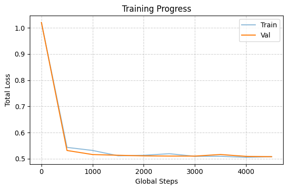 | 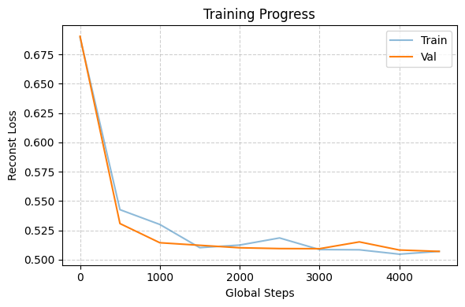 |
|  |  |

| Codebook Utilization | |
|---|---|
| 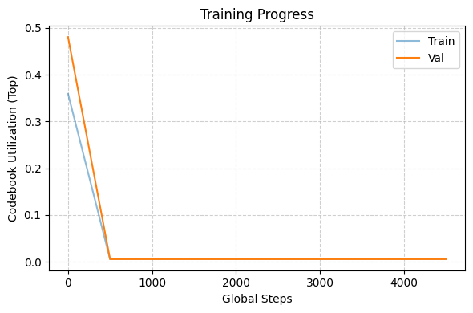 | 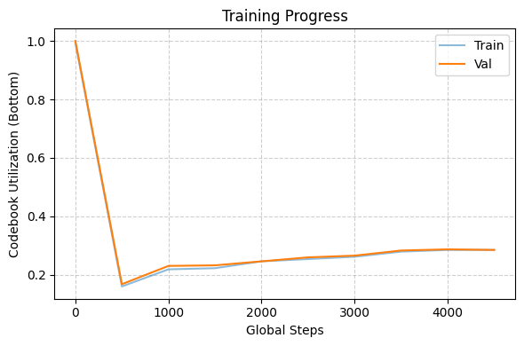 |

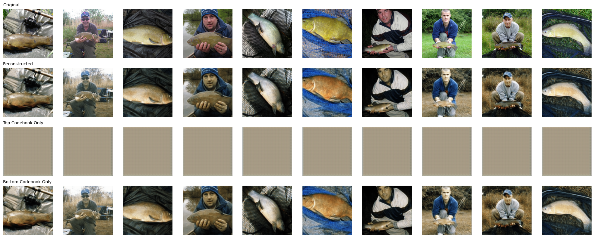

| Metric | Value |
|--------|-------|
| Top Codebook Utilization | **1%** |
| Bottom Codebook Utilization | **29%** |
| LPIPS | 0.3863 |
| rFID | 57.84 |

**Observations:**
- Top-only reconstruction is blank — the top encoder captures no meaningful structure at this configuration. The top codebook is essentially dead.
- Bottom-only reconstruction matches the full reconstruction almost exactly, meaning the bottom codes are encoding everything — both local and global information — bypassing the hierarchical design intent.
- Despite the collapsed hierarchy, reducing `latent_dim` improved LPIPS and rFID metrics relative to Exp 1, suggesting that lower-dimensional codes force more efficient, denser codebook use.

---

#### Exp 3 — No Normalization, Low Latent Dim *(Best Set 1)*

`normalize_codebook=False, latent_dim=8`

Removing codebook normalization while keeping the lower latent dim.

| Loss Curves | |
|---|---|
| 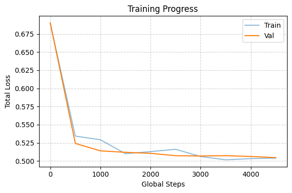 |  |
| 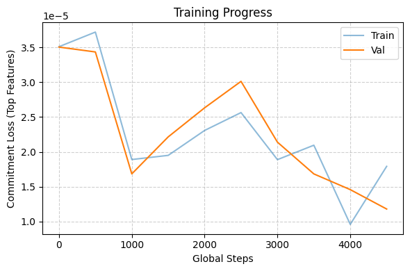 | 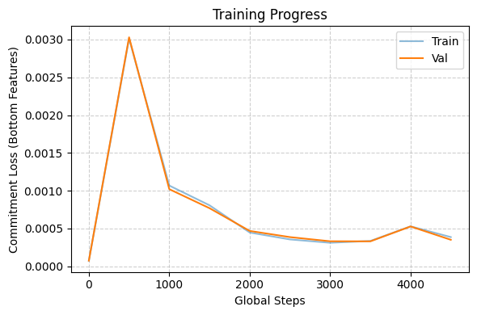 |

| Codebook Utilization | |
|---|---|
| 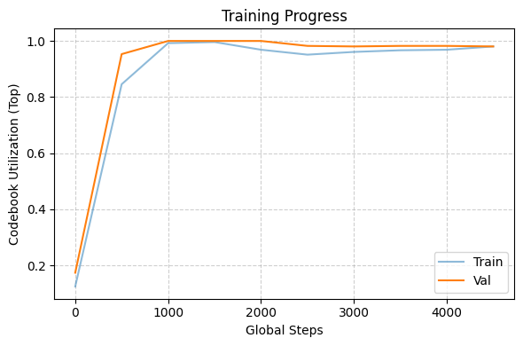 | 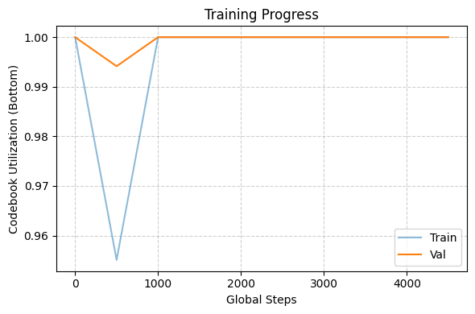 |

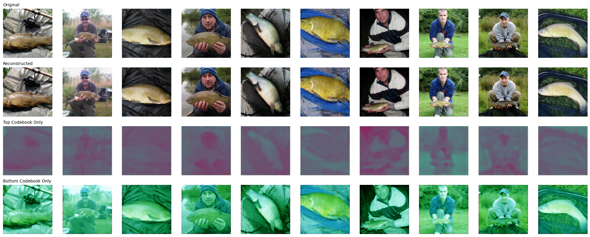

| Metric | Value |
|--------|-------|
| Top Codebook Utilization | **98%** |
| Bottom Codebook Utilization | **100%** |
| LPIPS | 0.3461 |
| rFID | 44.98 |

**Observations:**
- Removing codebook normalization is the decisive factor for dramatically improving codebook utilization — nearly all codes are active at both levels.
- The hierarchical structure now behaves as intended: top-only reconstruction shows a clear skeleton (global structure), and bottom-only reconstruction shows the full image with slightly off colors (local detail layered on top).
- Best LPIPS and rFID in Set 1. Confirms that higher codebook utilization directly correlates with better reconstruction quality.

---

#### Exp 4 — No Normalization, High Latent Dim

`normalize_codebook=False, latent_dim=64`

Same as Exp 3 but reverting latent dim back to 64 to isolate its effect.

| Loss Curves | |
|---|---|
| 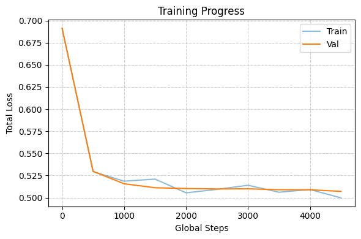 | 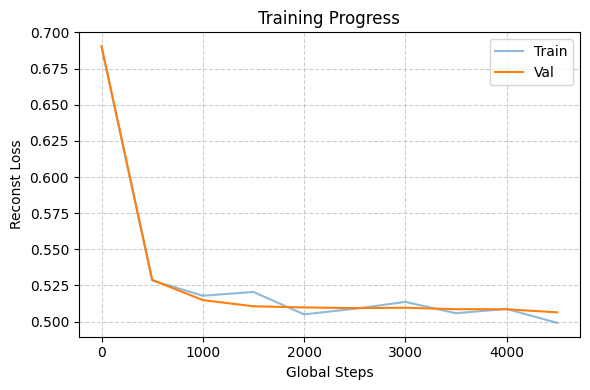 |
| 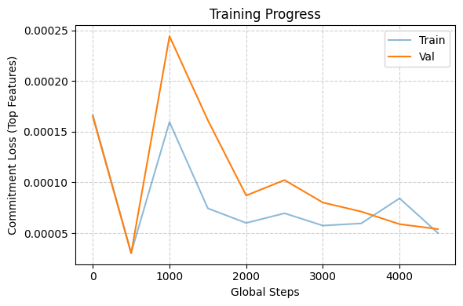 | 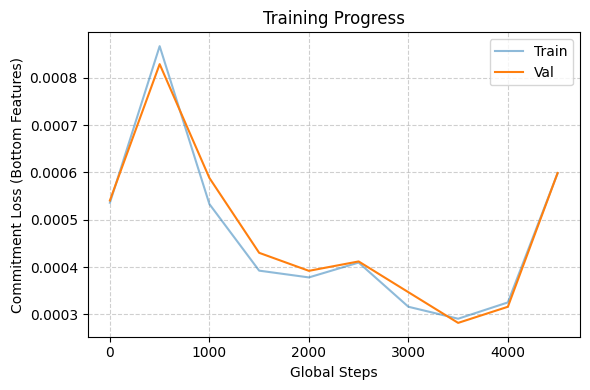 |

| Codebook Utilization | |
|---|---|
| 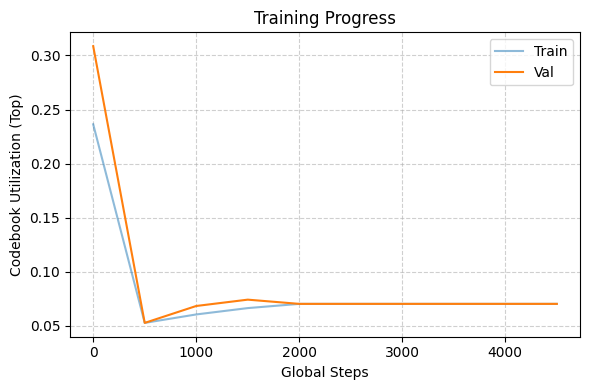 | 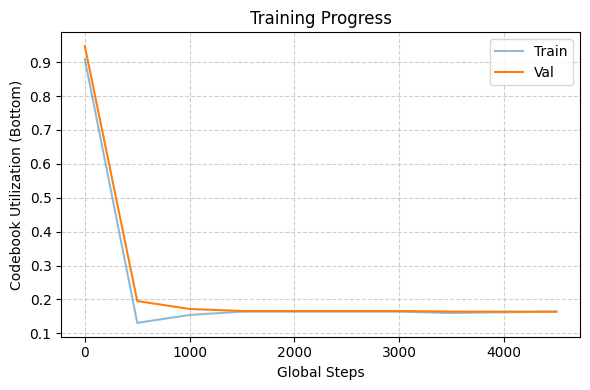 |

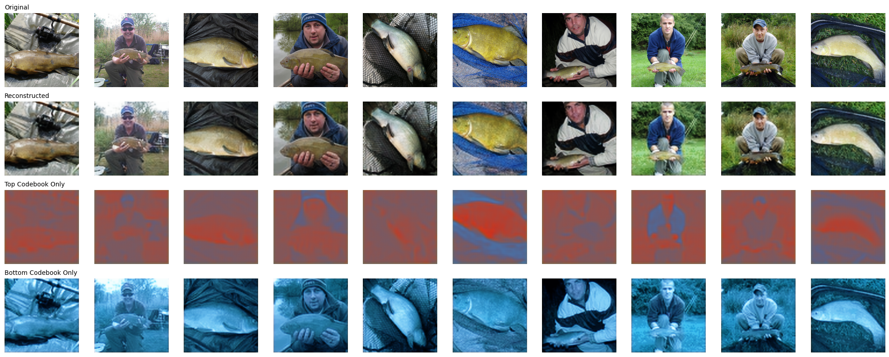

| Metric | Value |
|--------|-------|
| Top Codebook Utilization | **7%** |
| Bottom Codebook Utilization | **16%** |
| LPIPS | 0.3936 |
| rFID | 55.15 |

**Observations:**
- Removing normalization alone is not enough — with a high latent dim, codebook utilization drops sharply again (7% / 16% vs. 98% / 100% in Exp 3).
- A higher-dimensional codebook has more capacity but is harder to fill, especially with a smaller and less diverse dataset like Imagenette at ~9k images.
- Hierarchical structure is preserved (top captures global structure), but the large latent space results in worse metrics compared to Exp 3.

---

### Set 1 — Summary

| Exp | Norm | Latent Dim | Top Util | Bottom Util | LPIPS | rFID |
|-----|------|------------|----------|-------------|-------|------|
| 1 | ✅ | 64 | 3% | 5% | 0.4385 | 73.58 |
| 2 | ✅ | 8 | 1% | 29% | 0.3863 | 57.84 |
| 3 | ❌ | 8 | **98%** | **100%** | **0.3461** | **44.98** |
| 4 | ❌ | 64 | 7% | 16% | 0.3936 | 55.15 |

**Key takeaway:** Codebook normalization suppresses utilization severely. Disabling it, combined with a lower latent dimension, drives near-full codebook usage and significantly better reconstruction quality.

---

### Set 2 — Reconstruction + Commitment + Perceptual Loss

Adding LPIPS-based perceptual loss to the training objective to improve reconstruction sharpness.

---

#### Exp 5 — Perceptual Loss (weight=0.1), Low Latent Dim

`normalize_codebook=False, latent_dim=8, perceptual_weight=0.1`

Direct extension of Exp 3 (best from Set 1) with perceptual loss added.

| Loss Curves | |
|---|---|
| 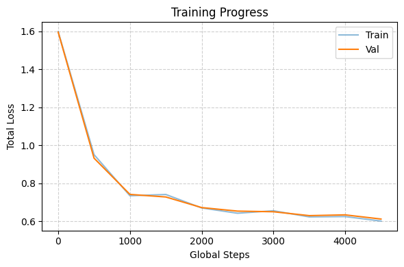 | 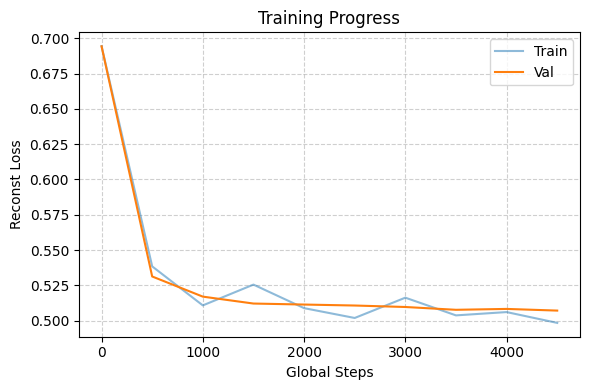 |
| 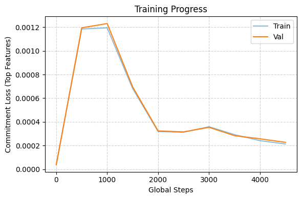 | 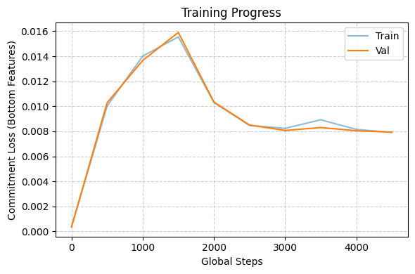 |
| 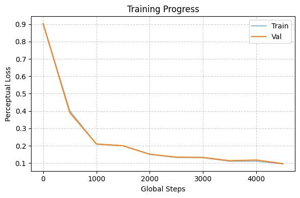 | |

| Codebook Utilization | |
|---|---|
| 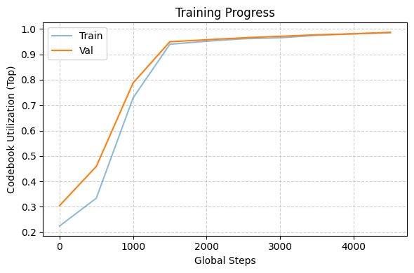 | 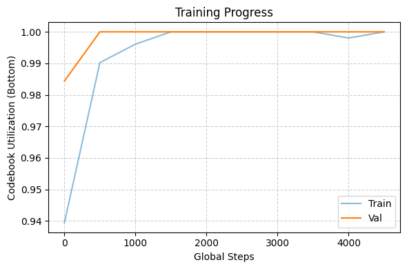 |


| Metric | Value |
|--------|-------|
| Top Codebook Utilization | **99%** |
| Bottom Codebook Utilization | **100%** |
| LPIPS | **0.0967** |
| rFID | **34.76** |

**Observations:**
- Adding perceptual loss dramatically improves reconstruction sharpness — LPIPS drops from 0.3461 to 0.0967, a ~72% improvement.
- However, the top-only reconstruction shows only a faint, barely-visible skeleton. It appears the top encoder is now capturing very little global structure.
- Bottom-only reconstruction matches the full reconstruction almost exactly, suggesting bottom codes are again encoding everything.
- This raises a question: did perceptual loss cause the top encoder to collapse, or is it the low latent dimension as seen in Exp 2?

---

#### Exp 6 — Perceptual Loss (weight=1), Low Latent Dim

`normalize_codebook=False, latent_dim=8, perceptual_weight=1`

Increasing the perceptual loss weight 10× to see if higher weight worsens or improves quality.

| Loss Curves | |
|---|---|
| 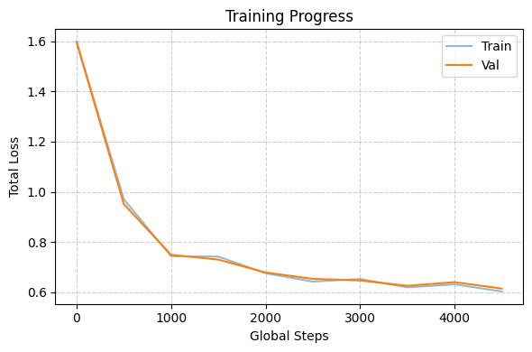 | 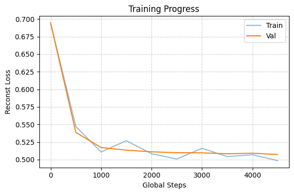 |
| 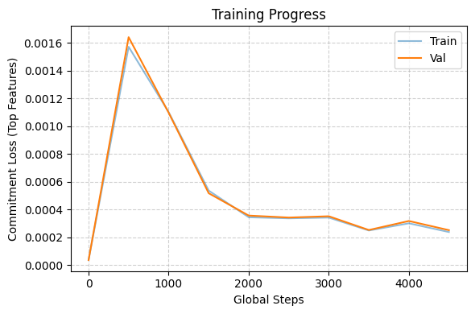 | 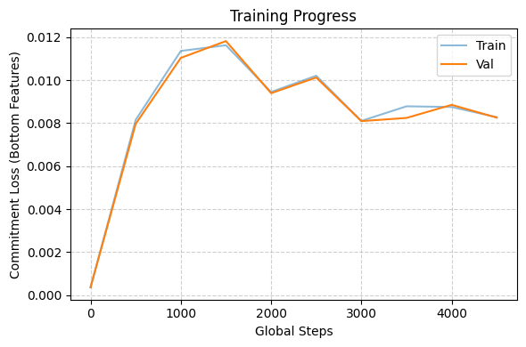 |
| 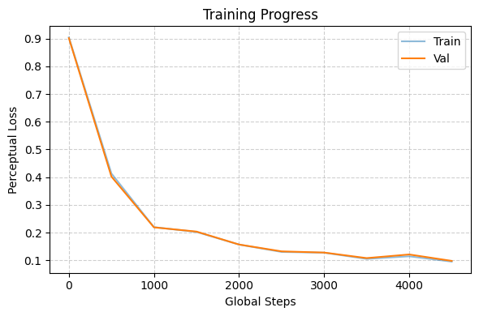 | |

| Codebook Utilization | |
|---|---|
| 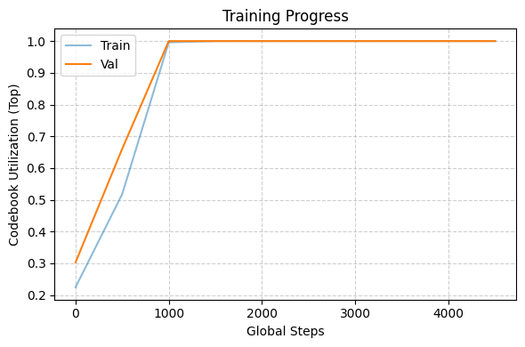 | 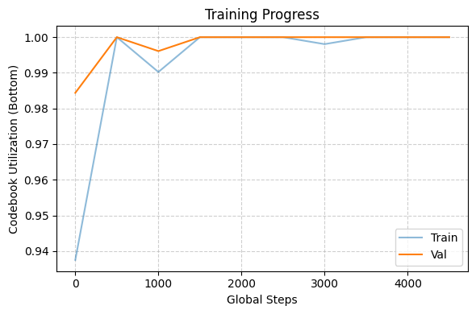 |

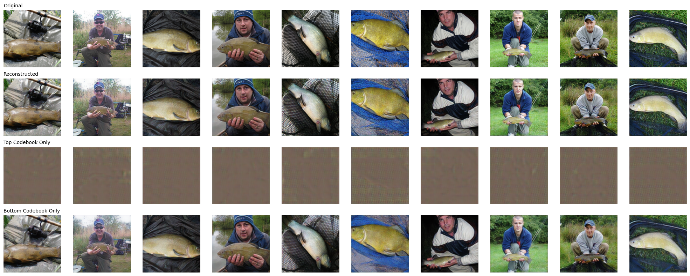

| Metric | Value |
|--------|-------|
| Top Codebook Utilization | **100%** |
| Bottom Codebook Utilization | **100%** |
| LPIPS | 0.0974 |
| rFID | 34.52 |

**Observations:**
- Increasing perceptual loss weight from 0.1 to 1 has virtually no effect on metrics (LPIPS: 0.0967 → 0.0974, rFID: 34.76 → 34.52).
- Top-only reconstruction still shows only a faded skeleton. The top encoder behavior is unchanged despite the stronger perceptual signal.

---

#### Exp 7 — Perceptual Loss (weight=0.1), High Latent Dim *(Diagnostic)*

`normalize_codebook=True, latent_dim=64, perceptual_weight=0.1`

**Motivation:** Exps 5 and 6 showed that with `latent_dim=8` + perceptual loss, the top encoder produces only a faint skeleton — similar to Exp 2 (`latent_dim=8`, no perceptual loss). But in Exp 1 (`latent_dim=64`, no perceptual loss), the top encoder clearly captured global structure. Is the collapsed top hierarchy caused by perceptual loss, or by the low latent dimension? This experiment mirrors Exp 1 (same `latent_dim=64`) but adds perceptual loss, to isolate the effect.

| Loss Curves | |
|---|---|
| 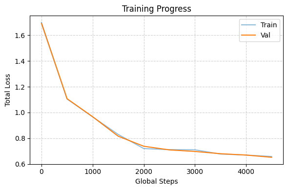 | 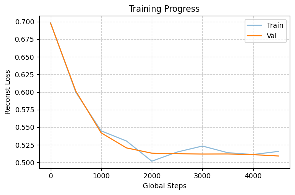 |
| 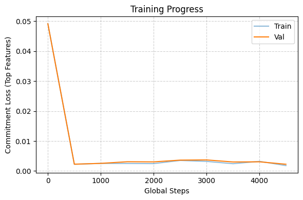 | 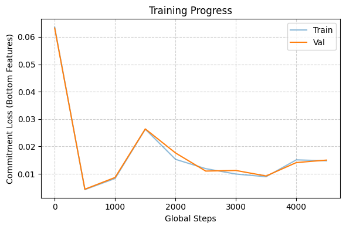 |
| 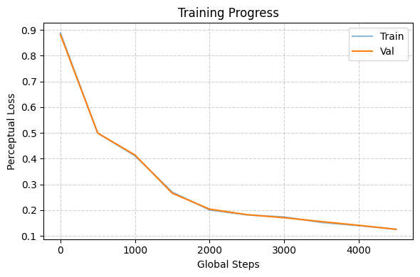 | |

| Codebook Utilization | |
|---|---|
|  | 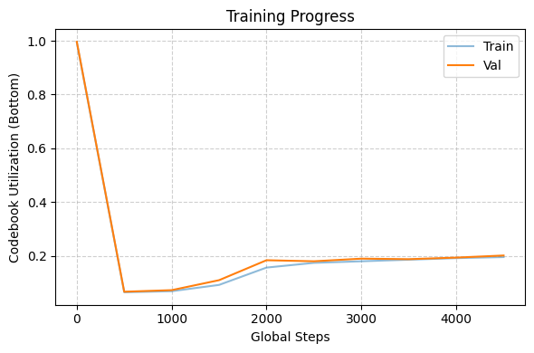 |

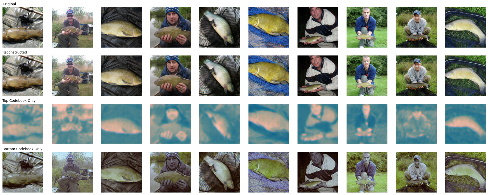

| Metric | Value |
|--------|-------|
| Top Codebook Utilization | **2%** |
| Bottom Codebook Utilization | **20%** |
| LPIPS | 0.1198 |
| rFID | 40.56 |

**Observations:**
- With `latent_dim=64` and perceptual loss, the top-only reconstruction shows a **clear and visible skeleton** — global structure is preserved.
- This confirms that the faded top skeleton in Exps 5 and 6 was **not caused by perceptual loss** — it was caused by the low latent dimension (8). With `latent_dim=8`, the top-level codebook simply doesn't have enough capacity to separately encode global structure; it collapses into the bottom level instead.
- This confirms that the faded top skeleton in Exps 5 and 6 was majorly due to `latent_dim=8` and perceptual loss had a very little role to play.
- Perceptual loss still improves sharpness compared to its non-perceptual counterpart (Exp 1): LPIPS drops from 0.4385 to 0.1198.
- Lower codebook utilization (2% / 20%) compared to Exps 5 and 6 — higher-dimensional codes are harder to fill with a small dataset, aligning with the pattern observed in Set 1.

---

### Set 2 — Summary

| Exp | Norm | Latent Dim | Percep Weight | Top Util | Bottom Util | LPIPS | rFID |
|-----|------|------------|---------------|----------|-------------|-------|------|
| 5 | ❌ | 8 | 0.1 | 99% | 100% | **0.0967** | 34.76 |
| 6 | ❌ | 8 | 1 | 100% | 100% | 0.0974 | **34.52** |
| 7 | ✅ | 64 | 0.1 | 2% | 20% | 0.1198 | 40.56 |

**Key takeaway:** Perceptual loss is highly effective at improving reconstruction sharpness. However, with `latent_dim=8`, the hierarchical design partially collapses — the bottom level takes over encoding both local and global information. The top level remains meaningful only when `latent_dim` is large enough to give it a distinct representational role.

---

## Overall Results Summary

| Exp | Set | Norm | Latent Dim | Percep Weight | Top Util | Bottom Util | LPIPS ↓ | rFID ↓ |
|-----|-----|------|------------|---------------|----------|-------------|---------|--------|
| 1 | 1 | ✅ | 64 | — | 3% | 5% | 0.4385 | 73.58 |
| 2 | 1 | ✅ | 8 | — | 1% | 29% | 0.3863 | 57.84 |
| 3 | 1 | ❌ | 8 | — | 98% | 100% | 0.3461 | 44.98 |
| 4 | 1 | ❌ | 64 | — | 7% | 16% | 0.3936 | 55.15 |
| 5 | 2 | ❌ | 8 | 0.1 | 99% | 100% | **0.0967** | 34.76 |
| 6 | 2 | ❌ | 8 | 1 | 100% | 100% | 0.0974 | **34.52** |
| 7 | 2 | ✅ | 64 | 0.1 | 2% | 20% | 0.1198 | 40.56 |

---

## Key Takeaways

- **Codebook normalization kills utilization.** Normalizing codebook vectors compresses all embeddings onto a hypersphere, reducing the effective capacity of the codebook and causing severe underutilization regardless of latent dimension. Removing normalization is the single most impactful factor for codebook health.

- **Lower latent dimension → higher codebook utilization → better metrics.** With a smaller dataset (~9k images), a lower-dimensional embedding space is easier to fill. This consistently leads to better LPIPS and rFID scores. The trade-off is a loss of representational capacity at the top level.

- **Latent dimension governs whether the hierarchy works as intended.** With `latent_dim=8`, the top encoder loses its ability to separately encode global structure when combined with perceptual loss — everything collapses into the bottom codes. With `latent_dim=64`, the top encoder clearly captures global structure (visible skeleton in top-only reconstructions) even if codebook utilization is low.

- **Perceptual loss is a major quality multiplier.** Adding LPIPS perceptual loss (even at weight=0.1) drops LPIPS by ~72% compared to reconstruction loss alone. Increasing the weight beyond 0.1 yields negligible additional gains — the model saturates quickly.

- **Perceptual loss isn't the major cause of top-level collapse.** The faded top-only reconstructions in Exps 5 and 6 were initially suspected to be caused by perceptual loss. Exp 7 disproves this — with `latent_dim=64` and perceptual loss, the top encoder still produces a clear structural skeleton. The culprit was the low latent dimension, not the loss function.
